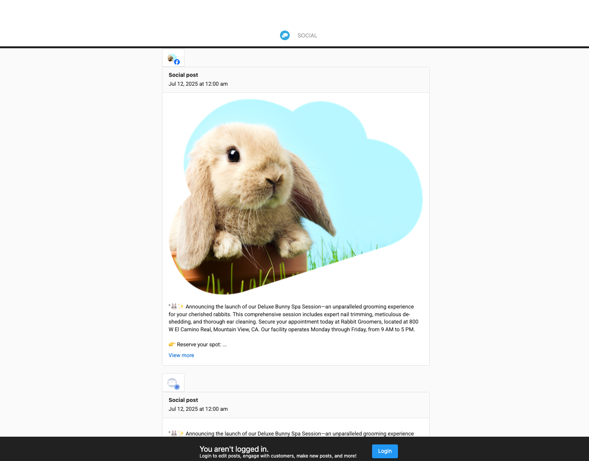

# Creating a Post Report

Social Marketing allows you to create detailed reports of your posts to share with clients or team members.

## Creating a Report

1. **Access Reports**: Go to **Social Marketing > Posts > Calendar**, then click **Create Report**
2. **Select Date Range**: Choose the time period for your report
3. **Choose Post Types**: Select which types of posts to include (scheduled, drafts, or both)
4. **Generate Report**: Click **Create Report** to generate your report
5. **Share Link**: Copy the generated link to share with others

## Report Features

- **Comprehensive View**: See all your scheduled posts in one place
- **Date Range Selection**: Customize the time period for your report
- **Post Type Filtering**: Include or exclude different types of posts
- **Shareable Links**: Generate links that can be shared with clients or team members
- **Real-time Updates**: Reports reflect current post status

## Using Reports

- **Client Approval**: Share reports with clients for content approval
- **Team Collaboration**: Keep team members informed about scheduled content
- **Content Review**: Review all scheduled posts before they go live
- **Planning**: Use reports for content planning and strategy development

## Report Access

Reports are accessible via generated links and can be viewed by anyone with the link, even if they don't have direct access to your Social Marketing account.

**Note:** Report links have expiration dates and access controls for security purposes.