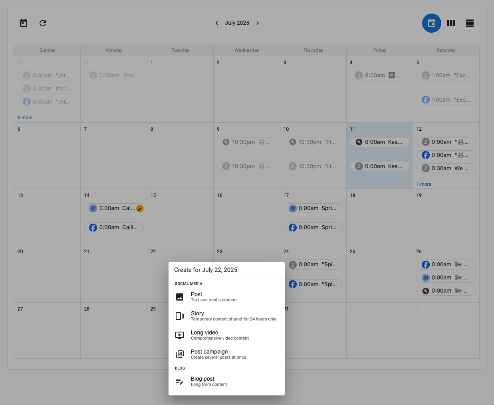

The **Calendar tab** in the Social Marketing product provides an easy, visual way to manage all your social content. From scheduling new posts to viewing drafts, it helps you stay organized and confident in your publishing strategy—all in one place.

## View Scheduled and Draft Posts at a Glance

The calendar view gives you a **month-long overview** of all your social posts:

- **Scheduled posts** appear with the exact time they’ll be published.
- **Draft posts** are also visible, helping you track what’s in progress.
- Quickly spot gaps in your content schedule or areas where adjustments may be needed.

## Create a New Post from Any Date

To start a new post, simply **click on any date** in the calendar. This will open the post editor, allowing you to:

- Choose the platform(s)
- Add your content, images, or links
- Schedule it immediately or save it as a draft

This helps streamline your workflow without needing to navigate away from the calendar.

## Share Your Calendar with Others

Need to share your content plan with your team, clients, or stakeholders?

Use the **Create report** option in the top-right corner of the calendar tab. This will generate a summary of your content schedule that can be shared via live link—perfect for collaboration, transparency, and approvals.

## Flexible View Options

You can switch between:

- **Monthly view** for a big-picture plan
- **Weekly view** for medium-range planning
- **Daily view** when you want to focus on a single day’s activity

These flexible layouts let you adjust how you manage and review your content schedule.

## Frequently Asked Questions 

Can I filter by specific social platforms in the calendar view?

A: Not at this time. The calendar displays posts across all connected platforms in one view. You may filter by specific platforms in the "Posts" tab.

How do I edit a post I see on the calendar?

A: Click on the post within the calendar, then click edit, and it will open in the post composer for changes.

Can I delete a post from the calendar view?

A: Yes. Click the post and choose the delete option from the post editor screen.

Who can see the calendar?

A: Any user with access to the Social Marketing product for that business location can view the calendar and its content. Any person can see the content within the report link, regardless of access to Social Marketing.

What kind of reports can I generate?

A: You can create a **calendar report** summarizing upcoming and draft posts, which can be shared for stakeholder review.

