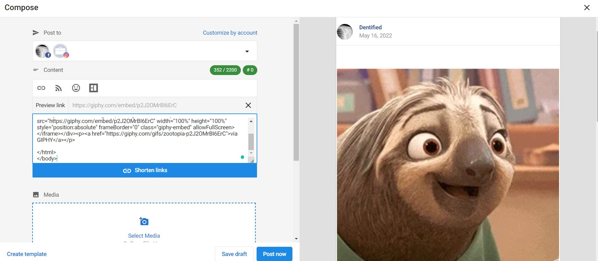

Yes! Users are able to add .gif to posts. Here is how;

1. On [giphy.com](http://giphy.com/), click on the selected GIF.
2. Once you click on the selected GIF, you will be directed to the GIF detail page.
3. Click "< > Embed" located on the right-hand side of the GIF.
4. From there, you will be presented with two embed options via the GIPHY Embed Player:
   - Select the "Responsive Off" switch for the iframe embed version.
   - Select the "Responsive On" switch for the HTML5 embed version

5. Paste the code into your post and publish!   

**To post the Giphy:**

At the beginning, include &lt;html&gt; &lt;body&gt;. Include the "embed code" of the giphy you want to add to the post. Add /html&gt; and /body&gt; at the end.

**Here's an example:**

```html
<html>
<body>

<div style="width:100%;height:0;padding-bottom:100%;position:relative;"><iframe src="https://giphy.com/embed/p2J2OMrBI6ErC" width="100%" height="100%" style="position:absolute" frameBorder="0" class="giphy-embed" allowFullScreen></iframe></div><p><a href="https://giphy.com/gifs/zootopia-p2J2OMrBI6ErC">via GIPHY</a></p>

</html>
</body>
```

