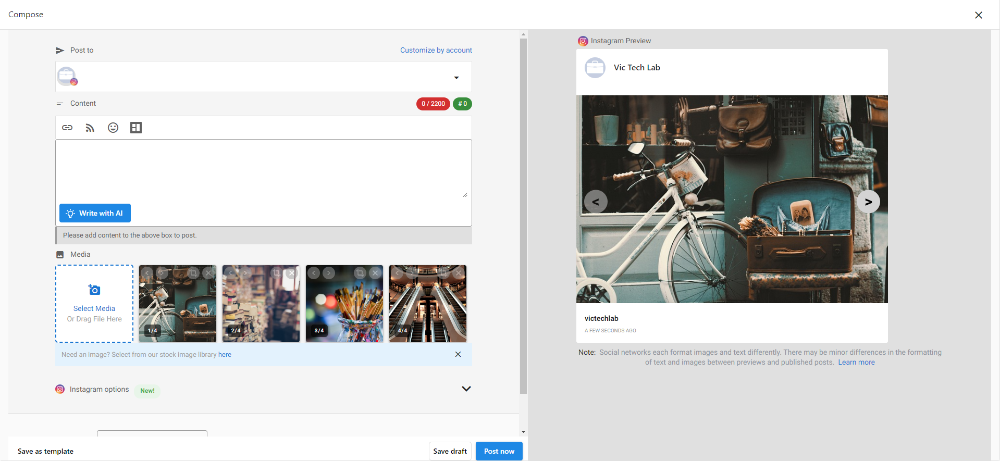

# Can I post multiple images to Instagram through Social Marketing?

Yes! Using the 'carousel' feature on Instagram, you can post up to 10 images or a mix of videos and images to Instagram through Social Marketing.

