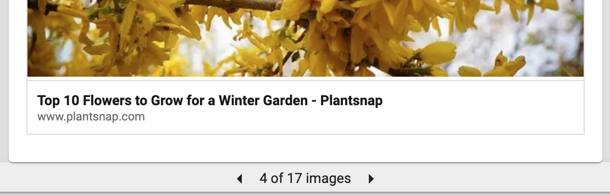

When creating a social post in Social Marketing, a link to an interesting article, a page on their website, or other interesting web content can be attached to a post on any network using the link-shortening tool  or by copying and pasting the link directly into the Content section.

Posts for Facebook, LinkedIn, and X will include an optional link preview on posts with a URL attached. The link preview will contain one of the primary images from the page being linked, as well as the title of the page and its domain name.

  

On link previews for LinkedIn posts, users are able to select the preview image from any image on the linked page using the left and right arrows below the post.

However, posts on Google Business Profile and Instagram will not include link previews on their posts. Instagram does not permit hyperlinks on individual posts, and while Google Business Profile allows hyperlinks on posts, they will not include a link preview.

Note that Google Business Profile posts can have an optional Call to Action button that can include a link. Users can add this button to their Google Business Profile posts in Social Marketing by creating a post in the Composer and selecting **Add a call to action** under the **Google Business Profile options** heading.