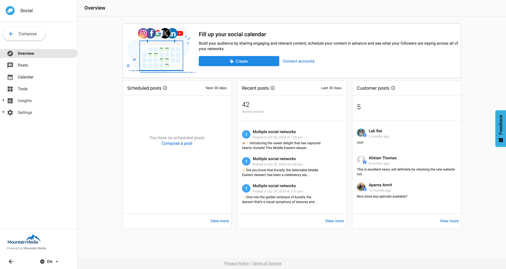

# Product Details - Social Marketing

**One Place to Stay Social**

Social media is hard to manage on your own. You need to come up with a nonstop stream of relevant content, build up social audiences, and engage with customers across all social channels, every single day. You know that social media is important for your business, but you need help. That's why you activated Social Marketing!

Social Marketing gives you one place to stay social. It gives you the power to generate leads, communicate with followers, and post to all your social media pages at once. It makes it easy to coordinate and schedule posts and comes with a bank of engaging ready-to-publish content. Social Marketing makes managing social media simple.

**Unlock the Full Potential of Social Media with Social Marketing:**

**1. AI-Driven Content Creation:**
- Engaging Content with one click: Generate engaging copy and images for multiple social platforms effortlessly.

**2. Streamlined Post Management:**
- Easy Scheduling: Draft, schedule, and approve posts with an intuitive content calendar.
- Upcoming Posts Overview: View and manage scheduled posts for the next 30 days.

**3. Comprehensive Analytics:**
- Centralized Reporting: Track reach and engagement across all social platforms in one report.
- Performance Insights: Analyze engagement and reach of posts over the past 30 days.

**4. Detailed Analytics Insights:**
- New Posts Tracking: Keep an eye on the number of published posts on all connected accounts.
- Engagement Metrics: Measure likes, comments, shares, and other key engagement metrics.
- Reach Analysis: Understand the number of people who have viewed your posts.
- Top-Performing Content: Identify posts with the highest reach and engagement.
- Audience Growth: Monitor the growth of your audience on Facebook and Twitter over time.

**5. Advanced Features:**
- Bulk Post Creation: Create multiple posts simultaneously using AI.
- In-Depth Analytics: Gain detailed insights on post performance, including views, reactions, comments, shares, and more.
- Data Export: Download CSV files for comprehensive post performance reporting.

***Please note:*** Some of these features may require [Social Marketing Pro](https://support.vendasta.com/hc/en-us/articles/4406959560983-What-are-Standard-and-Pro-product-editions).

