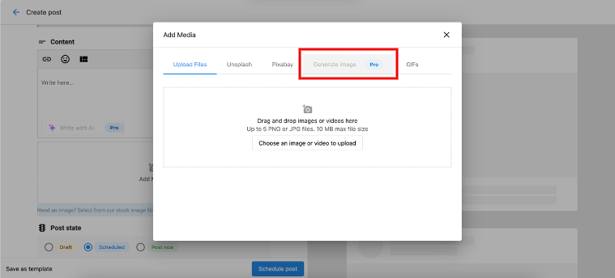
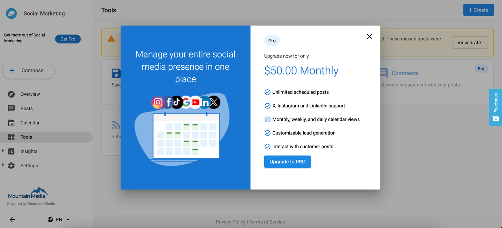
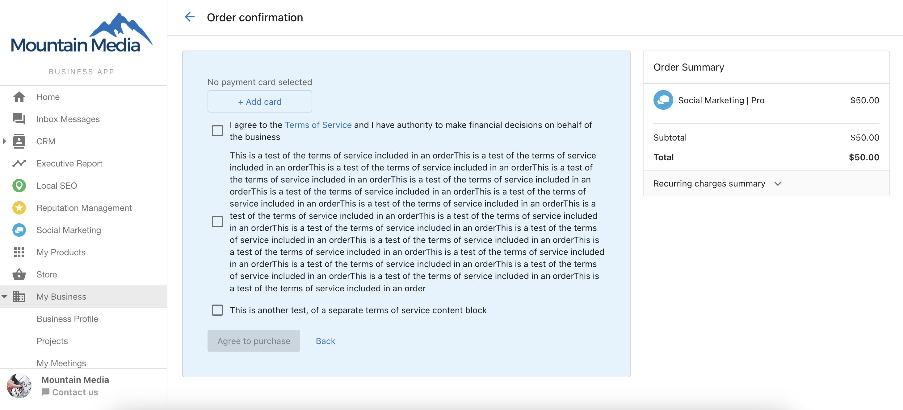
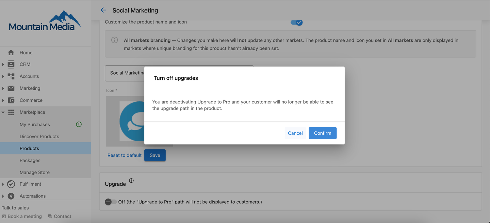

The Social Marketing Pro subscription offers enhanced features that can take your social media strategy to the next level. To ensure you're aware of these powerful tools, Pro-exclusive features within Standard accounts are marked with a PRO badge. Clicking on the PRO badge allows you to seamlessly upgrade your account and unlock these premium features.

### **Features of Social Marketing**

**Standard:**

- Connect to Facebook and Google
- Create draft posts, schedule posts and publish posts on Facebook and Google
- Create reports
- Create templates
- Add shortened link
- Add images from Unsplash, Pixabay, and GIF's
- Post Performance for Facebook and Google only
- Up to 20 scheduled posts at one time

**Pro:**

- Connect to Instagram, Twitter, Linkedin, and Tiktok
- Create posts and stories
- Write with AI
- Image generation using AI
- Bulk create with AI
- Clickable.bio
- Comments
- RSS content
- Link performance
- Post performance for all social connections
- Interesting content
- AI settings
- Unlimited scheduled posts
- Plus all Standard account features

Features available with Social Marketing Pro will be marked with a PRO badge. For example:

Clicking on the PRO badge will bring up a banner that allows you to upgrade:

Clicking upgrade will redirect the user to the payment screen to upgrade the Social Marketing account: 

**Note:** Partner Center Admins can switch off the toggle for **Upgrade**, under **Partner Center > Marketplace > Products > Social Marketing > Product Info > Upgrade**. If this is done, the PRO badge feature **will not** be displayed for Standard accounts.

