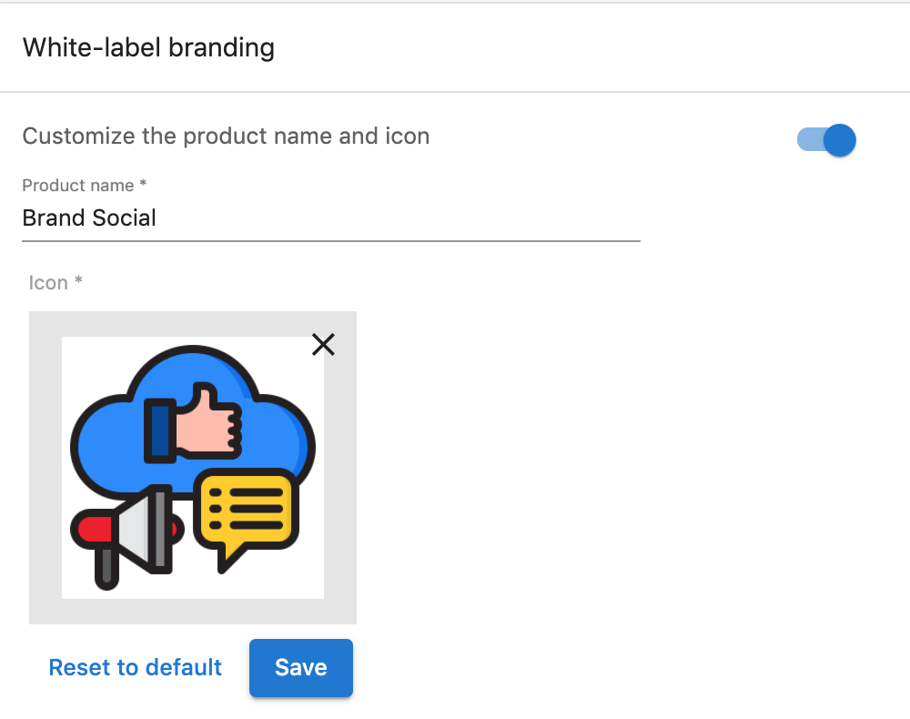
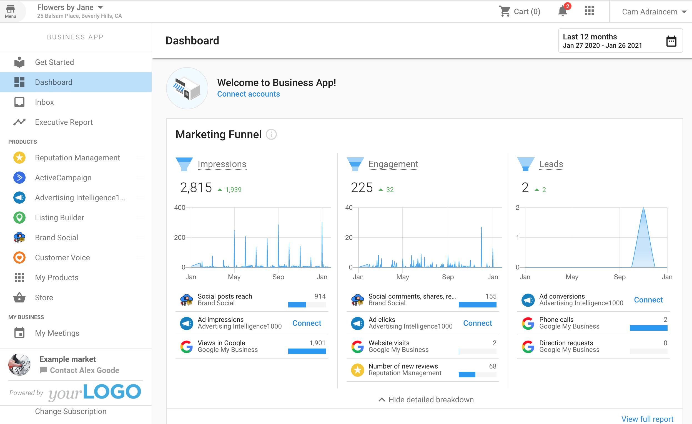
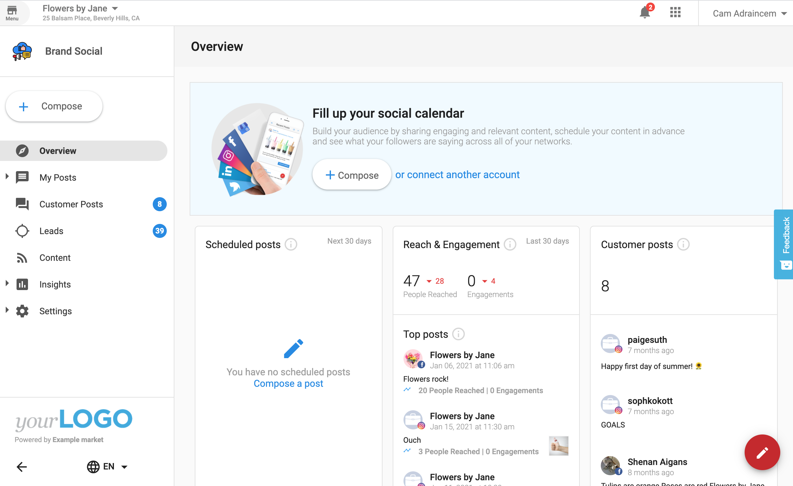

One of the many great things about Social Marketing is that you can customize it with your own product name and icon to brand it as your very own social app for your clients. Now, when you set a custom icon, it will appear not only in your store but also in your clients' Business App and Social Marketing app.

## How does white-label branding for Social Marketing work?

To white-label Social Marketing, follow these steps:

1. Make sure Social Marketing is enabled and [added to your Store](../general/adding-products-to-your-store).
2. Go to **Marketplace > Products**, and select Social Marketing.
3. Under **Product info**, turn on **White-Label branding**.
4. Enter your desired Product name and Icon.
5. Click **Save** to save your changes.

Your custom icon will automatically be visible in your clients' Business App and Social Marketing app, along with your Product Name.

To undo your changes and return the product to its original branding, select **Reset to default** under **Product info**.

*For this example, White-label branding was turned on. Social Marketing's Product name was changed to "Brand Social" and a different icon was selected.*

*In Business App, you can see the new Product name and Icon in the dashboard and under the Products section. Social Marketing now appears as "Brand Social".*

*Launching Brand Social will open your white-labeled version of Social Marketing.*

