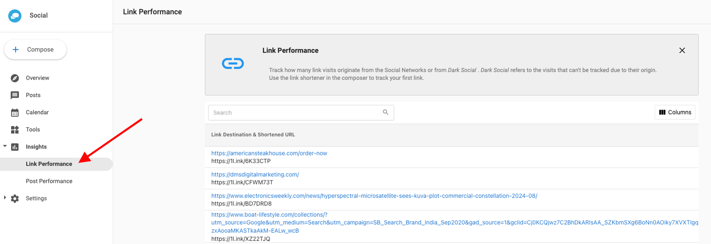

# Track Link Performance 

In Social Marketing, you can track how many clicks your shortened links get, broken down by platform.

On many platforms, you can add a link to your post to drive your audience to an article, website, etc. Tracking how these links are performing helps you provide proof-of-performance, and allows you to optimize content by seeing what's working (or, what is not!)

### How does tracking link performance work?

To see link performance in Social Marketing, go to **Insights > Link Performance**.

Here, you'll be able to track clicks by platform. Better yet, you can track clicks from outlets you may not even be aware of. The **Other** category shows how many clicks a post is getting from being shared via email, private messages, other websites, and more!

Social Marketing **_Pro_** is required to unlock this feature.