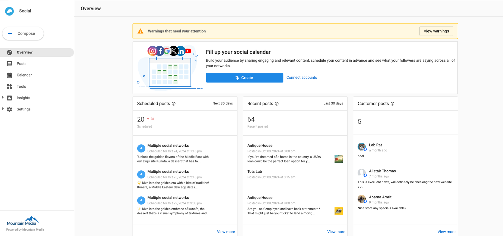

### **What is the Overview Page in Social Marketing?**

On the **Overview** page, you can see more information regarding your scheduled posts, post-performance, and customer posts. You can also see how many scheduled posts are coming within the next 30 days, how much engagement posts have received within the past 30 days, and how many more customer posts have been made by your audience.

Social Marketing users simply need to compose and post/schedule social media posts to see these analytics.

