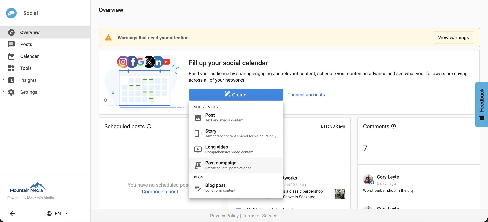
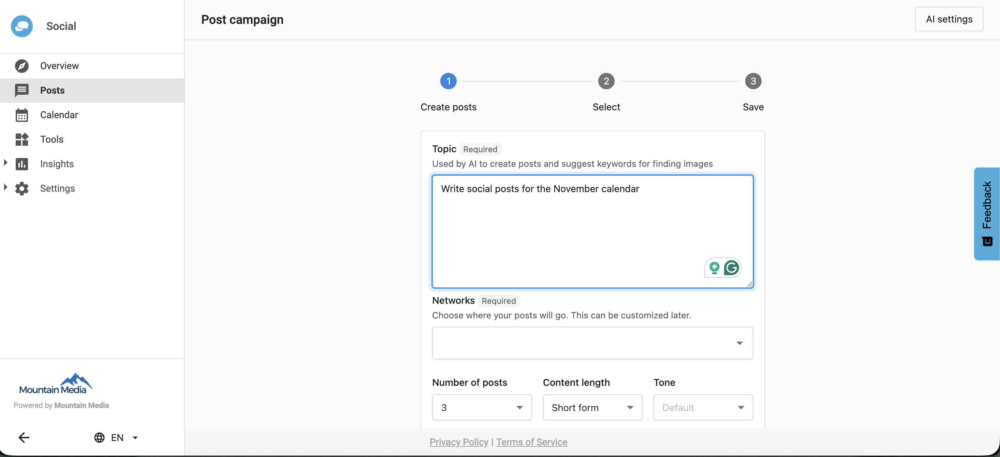
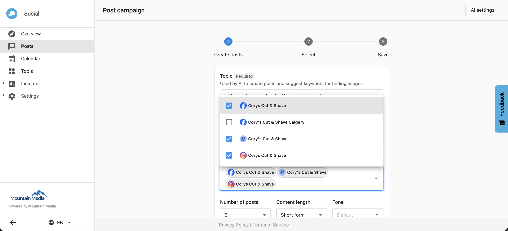
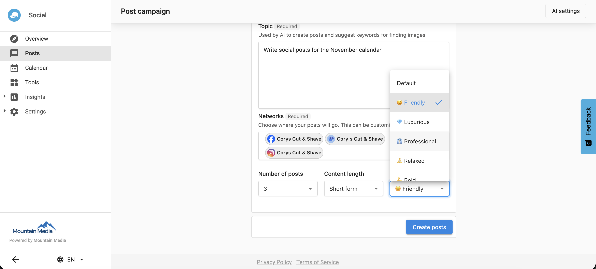
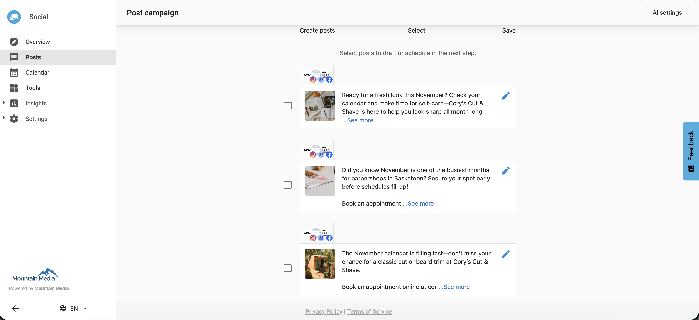
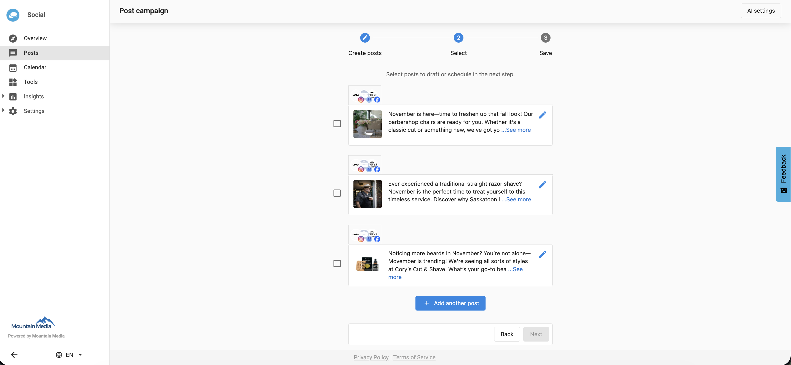
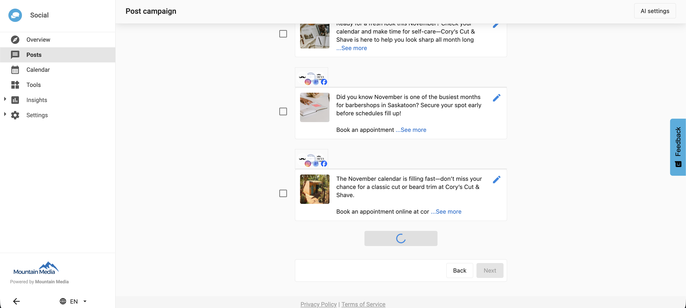
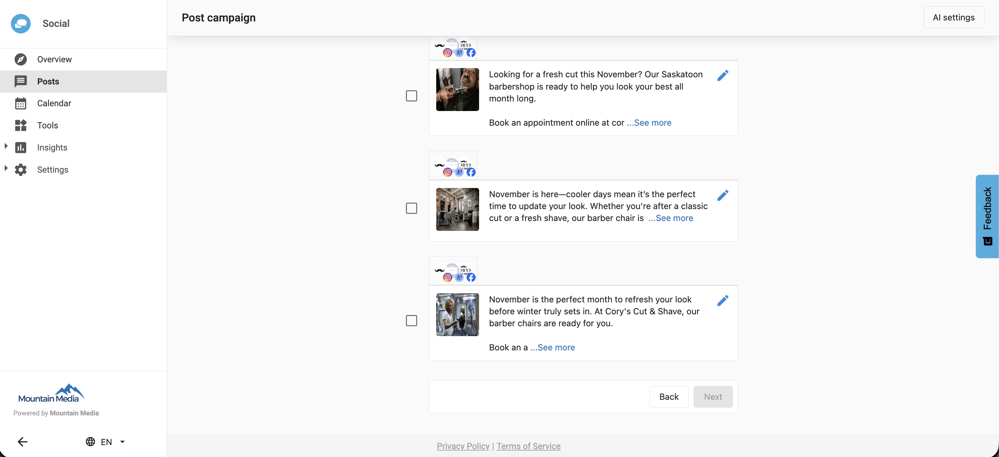

## What is the add post feature?

The **Add Another Post** feature allows you to generate additional AI-created posts directly within the Post Campaign workflow. You can now go beyond the preset options of 3, 6, 9, or 12 posts, up to a maximum of 20 posts per campaign, without restarting the process. This makes it easier to seamlessly create more content within a campaign.

## Why is adding posts important?

This feature helps you:

- Extend campaigns without starting over  
- Save time by generating extra content instantly  
- Maintain consistency across all posts in a campaign  
- Improve content scalability for ongoing campaigns  

By using AI, you can quickly fill out campaign calendars or adjust content volumes based on new needs.

## What’s included in the add post feature?

- An 'Add Another Post' button in step 2 of the Post Campaign workflow  
- AI-driven generation of additional posts based on your existing topic  
- Support for up to 20 total posts per campaign  
- Seamless integration with the existing campaign content  

## How to use the add post feature

1. Go to your dashboard and navigate to `Create` → `Post Campaign Workflow`.
  
2. Enter a topic or subject for the posts.  
  
3. Choose the social network where the posts will be published.  
  
4. Select how many posts to generate initially (3, 6, 9, or 12), and set the content length and tone.  
  
5. The AI will generate your first set of posts.
  
6. To add more posts, click 'Add Another Post' in step 2 of the workflow.  
  
7. The AI will generate additional posts based on your topic from step 1.  
  
8. You can repeat this process until you reach the maximum of 20 posts.
  

## Limits and usage notes

:::warning
The AI generation limit is **20 posts per workflow**. Once this limit is reached, you must start a new workflow to generate additional posts.
:::

### Post limits per workflow

| Initial posts | Additional posts allowed | Total posts per workflow |
|----------------|--------------------------|---------------------------|
| 3              | 17                       | 20                        |
| 6              | 14                       | 20                        |
| 9              | 11                       | 20                        |
| 12             | 8                        | 20                        |

:::info
The AI uses the original topic from Step 1 to generate new posts.  
To change tone, content length, or other campaign settings, start a new workflow.
:::

## Frequently asked questions

Where can I find the Add Another Post button?

You’ll find it in step 2 of the Post Campaign workflow after your initial posts have been generated.

Can I generate more than 20 posts in a campaign?

No. The limit is 20 posts per workflow to ensure fair AI resource use.

Can I change the topic after generating the first set of posts?

No. The AI continues using the original topic from step 1 for all additional posts.

Do new posts match the tone and length of the original batch?

Yes. The AI maintains the same tone and content length as the initial settings.

Can I add posts to a completed campaign?

Yes, as long as the campaign is still open in the Post Campaign workflow and under the 20-post limit.

Does the feature work for all social networks?

Yes. You can use it with any connected social network available in the Post Campaign workflow.

What happens if I need a different tone or topic?

Start a new Post Campaign workflow to apply new tone or topic preferences.

Is there an extra cost for generating more posts?

No. The feature is included as part of the standard workflow, within the AI generation limits.

What if I accidentally click 'Add Another Post' multiple times?

Each click will generate one additional post until the workflow reaches the 20-post maximum.

Can I edit or delete the AI-generated posts?

Yes. You can review, edit, or remove any generated post before scheduling or publishing.

