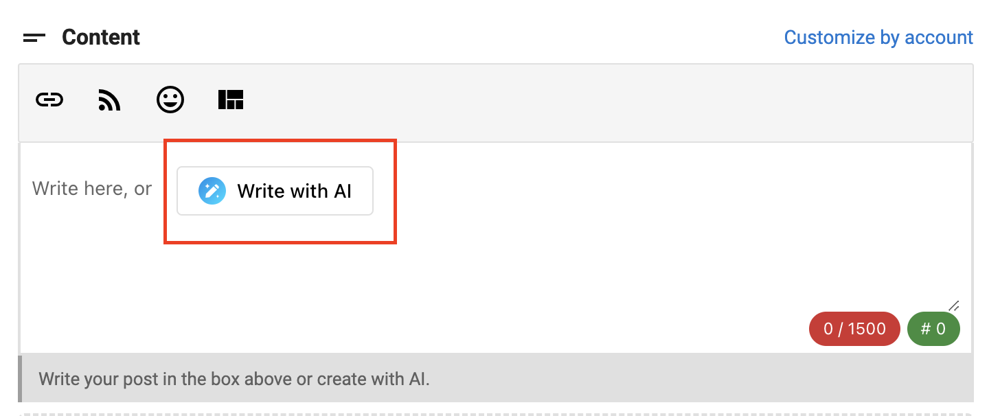

AI chat in Social Marketing will help you write unique posts tailored to the topic and audience. When crafting posts with AI, you are able to refine messaging, tone, and length through conversational text, rather than updating individual settings or providing entirely new prompts. Converse with AI through web chat to iterate on content until it's right.

### **How to Use AI Instructions**

**Step 1 -** Navigate to Social Marketing on the desired account.

**Step 2 -** Click **Compose** or **Create** a single post in the Social Composer for a single location.

**Step 3 -** You must have Social Marketing Pro for locations in multi-location and single location to use the AI feature.

**Step 4 -** Write a post in the text box or click **Write with AI** 

**Step 5 -** Once **Write with AI** is clicked, it opens up a conversation box which allows you to -

- Improve writing
- Shorten
- Lengthen
- Fix spelling and grammar
- Change tone

**Step 6 -** Use **Insert** to bring that specific text into the text box.

**Step 7 -** Use **Retry** if you would like AI to continue iterating on the previous content.