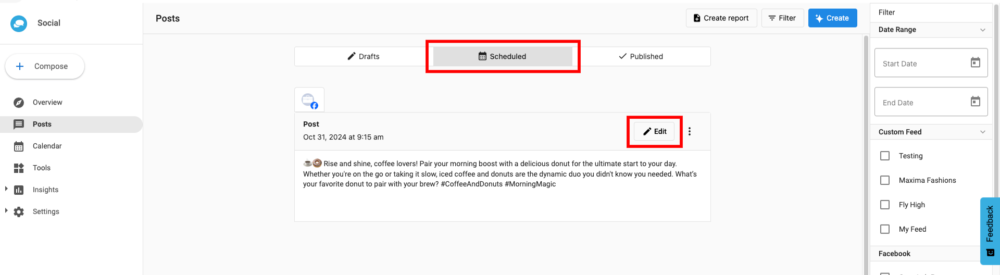
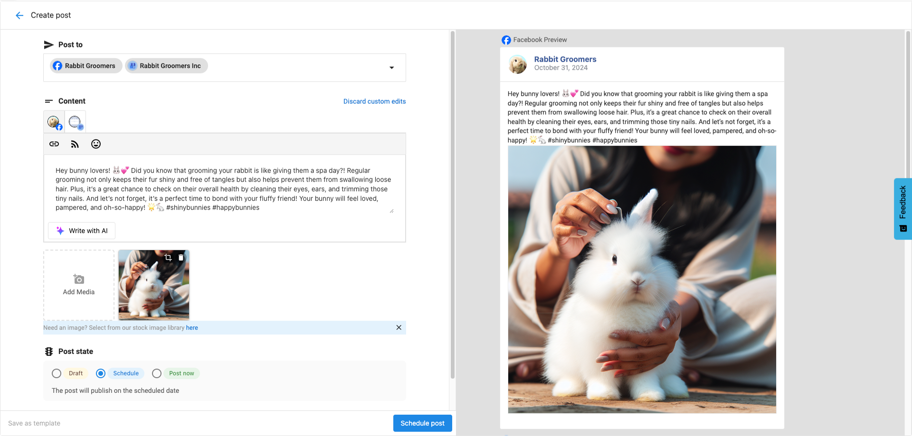
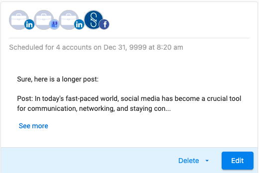

You or your clients can edit scheduled posts in Social Marketing before they are published.

### **How to edit or customize scheduled posts**

1. From **Social Marketing > Posts > Scheduled**, click **Edit** above the posts you wish to edit.
   

2. Editing your post gives you the same options as when you [initially composed the post](/vendasta-products/vendasta-products-social-marketing/vendasta-products-social-marketing-posts/compose-a-post). Once you are satisfied with how it looks, click **Schedule Post**.

3. To customize a post within the group you are editing, click **Customize by account**. Select the post you'd like to edit and change its content or image and click **Schedule Post** to save your changes.

   

### **FAQs**

**Q: How long in advance can we schedule posts in Social Marketing? Is there a time limit to schedule posts in advance?**

A: You can schedule a post until 31st Dec, 9999.

