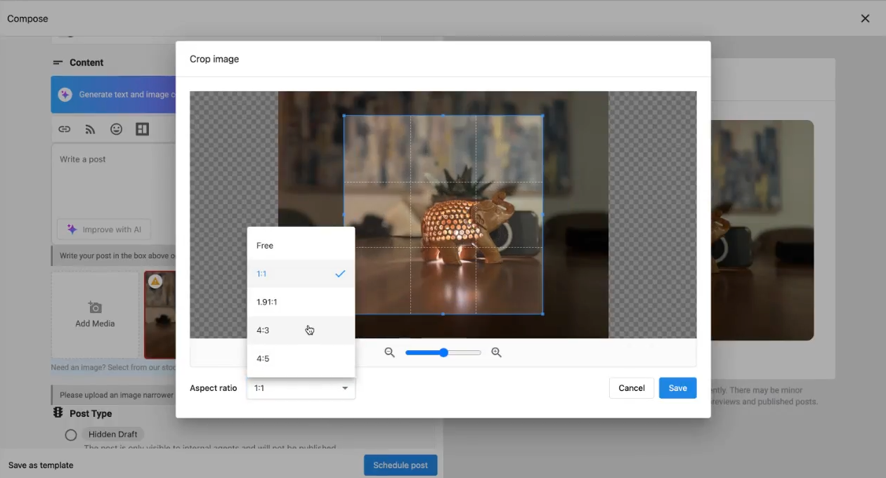

<iframe src="//www.youtube-nocookie.com/embed/PtSGpHK59XY" width="560" height="315" frameBorder="0" allowFullScreen=""></iframe>

When uploading images for social posts, it's crucial to meet the aspect ratio requirements of each platform. If these requirements aren't met, an error may occur, suggesting the need for cropping. While cropping helps, it often results in losing the original image, which can be frustrating. Our enhanced image cropping feature addresses this by ensuring you achieve the perfect dimensions without compromising the integrity of your images. Proper image cropping keeps the visual focus on key elements, enhances aesthetic appeal, and adheres to platform-specific dimensions. This avoids awkward cuts, boosts viewer engagement, and maintains a professional appearance, helping you effectively convey your message. 

### **How does image optimization work?** 

1. When a user uploads an image and it does not meet the aspect ratio of the selected social networks show them the error message so that they can click crop and open up to crop the image and select the relevant aspect ratio
2. When a user clicks the crop icon from the image they should be able to select from four options (Free, Square 1:1, Vertical 4:5, Horizontal 1.91:1)
3. When posting to Google Business Profile you will see a notice stating: "On submission, Google Business will scale the image resolution slightly without a perceptible loss in quality."

