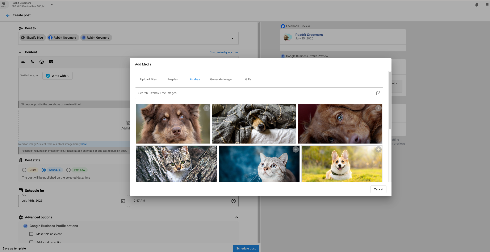
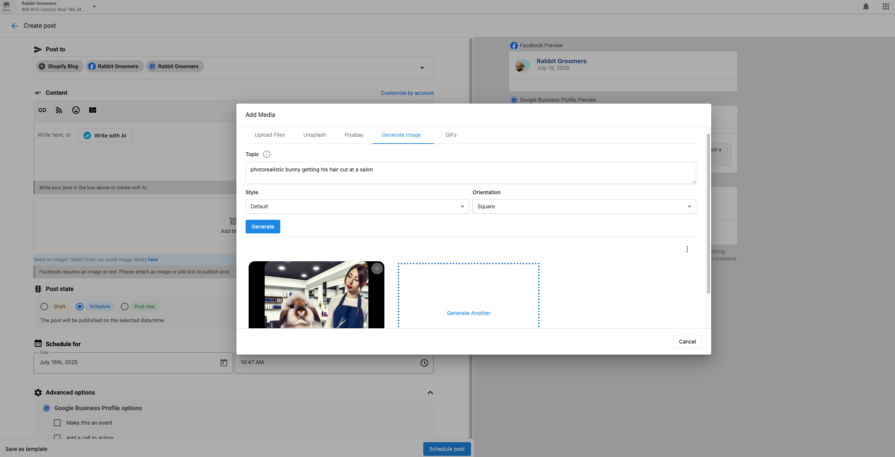

# Using Images in Social Marketing

Creating visually engaging posts is key to improving social media performance. This guide explains how to use royalty-free images, AI-generated graphics, carousels, Instagram Stories, and more — all within Social Marketing.

---

## Options for Adding Images

### 1. Royalty-Free Images via Pixabay

Easily search and add royalty-free images directly in the composer.

**Steps:**
1. Navigate to **Social Marketing > Create**
2. Scroll to the **Media** section and click **Add Media**
3. Select **Pixabay**
4. Search using keywords
5. Choose and insert an image into your post



---

### 2. AI-Generated Images

Generate professional images using AI.

**How to Generate:**
1. Click the **AI icon** in the post composer
2. Select **Image Generation**
3. Enter a detailed description
4. Choose your preferred style
5. Review and insert the result



**Features:**
- Custom prompts and style options
- Brand-consistent output
- Multiple variations
- Fast and professional results

**Best Practices:**
- Be specific with descriptions
- Align output with brand aesthetics
- Experiment with multiple prompts

---

### 3. Upload Your Own Media

Drag and drop files or select from your device to upload images or videos.

**Supported Image Formats:** PNG, JPEG, GIF

---

### 4. Instagram Carousel Posts

Create multi-image or multi-video posts for Instagram.

**Steps:**
1. Go to **Posts > Create > Post**
2. Choose **Instagram** as a platform
3. Upload up to 10 images/videos
4. Rearrange items with drag & drop
5. Add a caption and schedule or publish

**Best Practices:**
- Use a strong first image
- Maintain consistent style
- Tell a visual story

---

### 5. Instagram Stories

Create short-lived vertical content for Instagram.

**Steps:**
1. Click **Create > Story**
2. Select Instagram accounts
3. Upload a vertical 9:16 image or video
4. Choose **Publish Now**, **Schedule**, or **Save as Draft**

**Requirements:**
- **Images:** JPG, PNG (max 4MB)
- **Videos:** MP4, MOV (max 30MB, 15 sec max)

**Tips:**
- Keep content engaging and vertical
- Include a CTA
- Showcase behind-the-scenes or authentic moments

---

## Cropping & Optimization

When uploading, ensure your media meets aspect ratio requirements. If not, you’ll be prompted to crop using:

- Freeform
- Square (1:1)
- Vertical (4:5)
- Horizontal (1.91:1)

This ensures your images appear correctly across platforms.

---

## FAQs

<details>
<summary>Can I add GIFs to social media posts?</summary>

Yes! You can upload .gif files directly or embed from Giphy using HTML iframe code.

1. On giphy.com, click on the selected GIF.

2. Once you click on the selected GIF, you will be directed to the GIF detail page.

3. Click "< > Embed" located on the right-hand side of the GIF.

4. From there, you will be presented with two embed options via the GIPHY Embed Player:

5. Select the "Responsive Off" switch for the iframe embed version.
Select the "Responsive On" switch for the HTML5 embed version

6. Paste the code into your post and publish!

**To post the Giphy:**

At the beginning, &lt;html&gt; &lt;body&gt;. Include the "embed code" of the giphy you want to add to the post. Add /html&gt; and /body&gt; at the end.

**Here's an example:**

```html
<html>
<body>

<div style="width:100%;height:0;padding-bottom:100%;position:relative;"><iframe src="https://giphy.com/embed/p2J2OMrBI6ErC" width="100%" height="100%" style="position:absolute" frameBorder="0" class="giphy-embed" allowFullScreen></iframe></div><p><a href="https://giphy.com/gifs/zootopia-p2J2OMrBI6ErC">via GIPHY</a></p>

</html>
</body>
```
</details>

<details>
<summary>Can I post multiple images to Instagram?</summary>

Yes. Use the **carousel** feature to upload up to **10 images or videos** in a single Instagram post.
</details>

<details>
<summary>Why does Facebook reduce image quality?</summary>

Facebook compresses all uploaded images. To preserve image quality:

- Save your image as a **JPEG** using the **sRGB color profile**
- Keep the image width **2048px or less**
</details>

<details>
<summary>Can I post photos to multiple platforms at once?</summary>

Yes. You can select multiple platforms in the composer to post simultaneously. Supported platforms include:

- Facebook  
- Instagram  
- LinkedIn  
- X 
- Google Business Profile
</details>

<details>
<summary>What image formats are supported?</summary>

- **PNG**  
- **JPEG**  
- **GIF**
</details>

<details>
<summary>What's the best image ratio for all platforms?</summary>

**Square (1:1)** images offer the most compatibility and consistency across all social networks.
</details>

<details>
<summary>Should I review AI-generated images?</summary>

Yes. Always review and adjust AI-generated images to:

- Match your **brand voice** and **visual identity**
- Ensure the image aligns with your message
- Maintain **professional quality**
</details>

<details>
<summary>Which AI model is used to generate images?</summary>

The AI model used to generate images in Social Marketing is GTP Image 1.
</details>