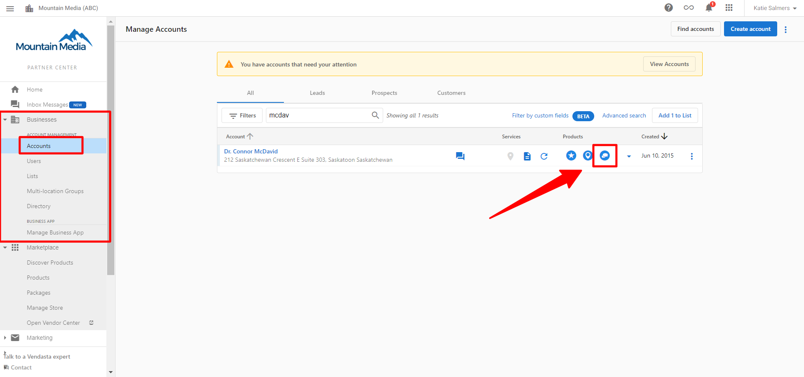
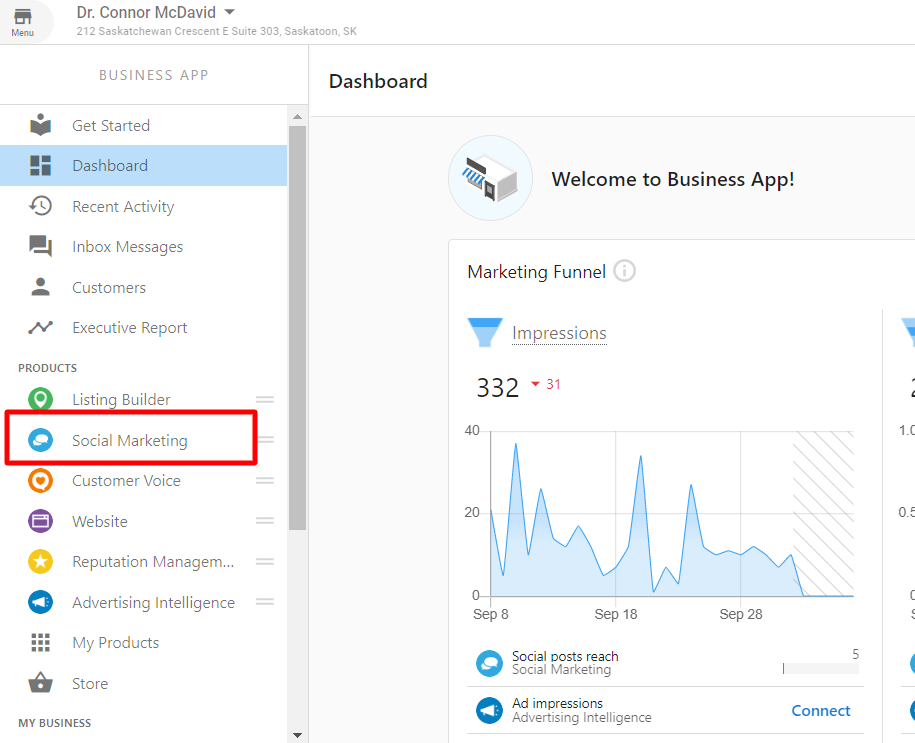
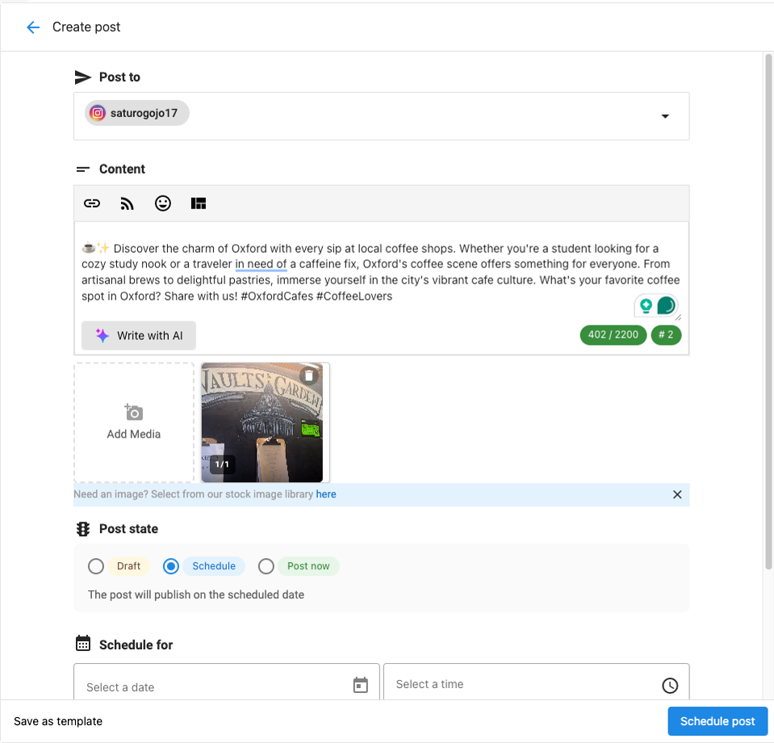
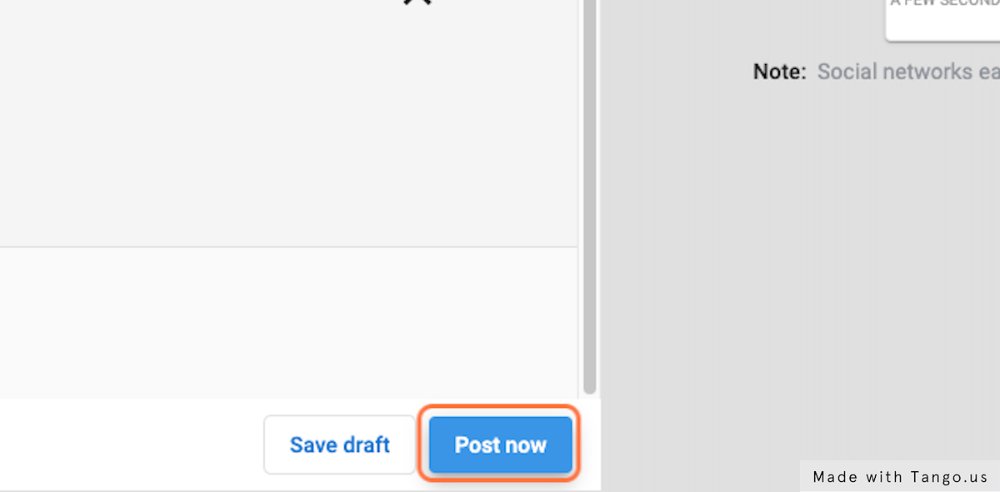
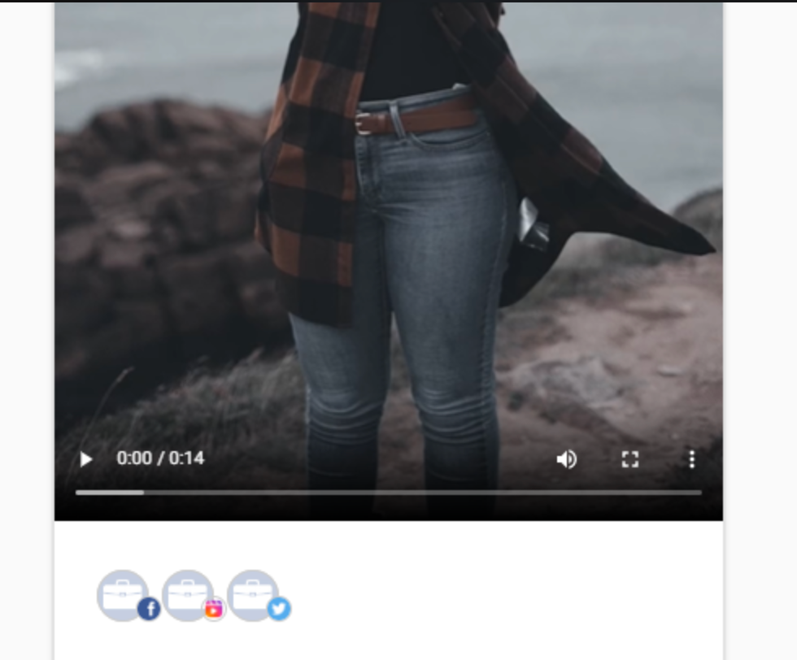

# Instagram Reels

## Getting Started

Reels are Instagram's response to TikTok, where users can create and share short-form vertical videos of up to 90 seconds in length. Like TikTok, Instagram provides music, AR effects, timers, and countdowns. Reels can be shared on Instagram feeds and, if the account is public, they can be made available to the wider Instagram community through Explore where they may be featured if deemed entertaining and inspiring enough.

Instagram Reels are similar to Instagram Stories, as both are video content types that display in a full-page vertical format. However, the key difference is that Instagram Stories disappear after 24 hours, whereas Instagram Reels remain on your profile permanently (unless manually deleted).

:::note
Reels enable Instagram users to create engaging and entertaining short-form videos. While designed for mobile creation, Vendasta enables users to create and schedule this native video format for their clients via desktop!
:::

## Creating and Publishing Instagram Reels

### Single Image Reels

You can create a single image Reel with any image from your Media Library or Media Browser. You can also upload a new image from your hard drive. Here's the process:

1. When creating a new Instagram Post, you can select to create either a Post, a Carousel (multi-image or multi-video post), or a Reel.
2. Choose **Reel**

3. Now, select the image you want to use from your Media Library or Media Browser, or upload a new image from your hard drive.
4. Once you have selected your image, set the Reel length using the Music Duration selector. You can set the length between 5 and 90 seconds.
5. You can add music to your Reel from our stock music selection. Click **Add Music**. Then choose your music track and select the portion of the track you wish to use in the Reel.

6. Ensure your location service is set to Instagram Reels in the dropdown menu.

7. Write your caption (including hashtags and mentions) and select your publishing option: **Publish Now**, **Schedule for Later**, or **Save as Draft**.

:::tip
If you select **Schedule for Later**, ensure that your Instagram account is connected to a Facebook page and that you're using a Professional account (Business or Creator). If not, the post will be sent to your Content Calendar and will have to be manually published to Instagram at the scheduled time.
:::

### Multi-Image Reels

You can also create a Reel using multiple images from your Media Library or Media Browser. The process is similar to creating a single image Reel, but with a few additional steps:

1. When creating a new Instagram Post, select **Reel**.
2. Select multiple images (up to 10) from your Media Library or Media Browser, or upload new images from your hard drive.
3. Once you have selected your images, set the Reel length using the Music Duration selector. This is the total duration of your Reel (all images combined).
4. Set the transition effect. This determines how the Reel transitions from one image to the next:
   - **Hard Cut**: Images immediately cut to the next without any transition effect
   - **Cross Dissolve**: Images fade from one to the next
   - **Wipe Up, Wipe Left, Wipe Down, Wipe Right**: Images are replaced by sliding in from the selected direction
   - **Slide Up, Slide Left, Slide Down, Slide Right**: Images slide in from the selected direction, moving the existing image out of the frame

5. You can add music to your Reel as with single image Reels.
6. Ensure your location service is set to Instagram Reels in the dropdown menu.
7. Write your caption and select your publishing option.

### Video Reels

You can also create a Reel using a video from your Media Library or Media Browser, or by uploading a new video from your hard drive:

1. When creating a new Instagram Post, select **Reel**.
2. Select a video from your Media Library or Media Browser, or upload a new video from your hard drive.
3. Videos for Reels must be less than 90 seconds in length. If your video is longer, you will be prompted to trim it.
4. If you wish to add music, the music will replace the video's original audio. If you prefer to keep the video's original audio, do not add music.
5. Ensure your location service is set to Instagram Reels in the dropdown menu.
6. Write your caption and select your publishing option.

## Best Practices for Instagram Reels

1. **Keep it short and engaging**: While Reels can be up to 90 seconds, shorter videos often perform better. Aim for 15-30 seconds of high-quality, engaging content.

2. **Use trending audio**: Incorporate popular songs or trending audio clips to increase the likelihood of your Reel being discovered.

3. **Utilize text and captions**: Add text overlays to your Reels to communicate key messages, especially since many users watch without sound.

4. **Incorporate hashtags**: Use relevant hashtags to help your Reel reach more people. Include trending hashtags where appropriate.

5. **Create high-quality content**: Ensure your Reels are well-lit and clearly visible. Avoid using content that's too blurry or low-resolution.

6. **Be authentic**: Showcase your brand's personality and values through your Reels. Authentic content tends to resonate more with audiences.

7. **Post consistently**: Regular posting helps keep your audience engaged and signals to the Instagram algorithm that you're an active user.

8. **Analyze performance**: Pay attention to which Reels perform well and try to understand why, then replicate those elements in future content.