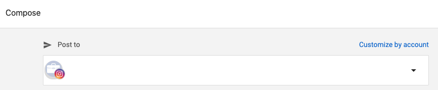
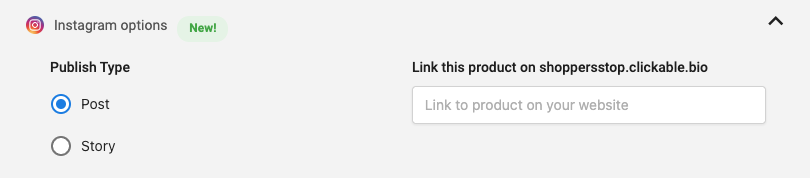
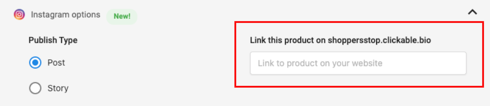

# Instagram Stories in Social Marketing

Instagram Stories is a feature that allows Instagram users to post photos and videos that disappear after 24 hours. In Social Marketing, you can create Instagram Stories that can be published directly to your clients' Instagram accounts. Let's explore how to create and publish Instagram Stories in Social Marketing.

## Create an Instagram Story Post

To create an Instagram Story post in Social Marketing, follow these steps:

1. From the **Calendar** or **Posts** page, click the **Create** button, and then select **Story** from the dropdown menu.

2. Ensure **Instagram Story** is selected from the list of post options.

   

3. In the **Create Post** window, select the Instagram accounts where you want to publish the Story.

   

4. Click the **Upload** button to add an image or video to the Story. You can upload any 9:16 ratio image or video.

   

5. Choose when to publish the Story:
    - **Publish now**: Post immediately
    - **Schedule**: Set a specific date and time for publishing
    - **Save as draft**: Save the post to edit later

6. Click **Publish**, **Schedule**, or **Save as draft** depending on your choice in the previous step.

## Instagram Story Requirements

- **Image/Video Ratio**: 9:16 (portrait orientation)
- **Image File Types**: JPG, PNG
- **Video File Types**: MP4, MOV
- **Maximum Video Length**: 15 seconds
- **Maximum File Size**: 30MB for videos, 4MB for images

## Best Practices for Instagram Stories

- **Use vertical content**: Create content specifically for the 9:16 vertical format
- **Keep it engaging**: Stories disappear after 24 hours, so make them attention-grabbing
- **Include a call to action**: Encourage viewers to send a message or visit a profile
- **Be authentic**: Stories are perfect for behind-the-scenes content and authentic moments

## Limitations

- Instagram Stories are only available for Instagram accounts
- Stories disappear after 24 hours unless saved as Highlights
- Some interactive features may only be available for accounts with a certain number of followers

## Troubleshooting

If you encounter issues publishing Instagram Stories:

1. Ensure the Instagram account is properly connected in Social Marketing
2. Verify the image or video meets Instagram's requirements
3. Check your internet connection
4. Try refreshing the page or logging out and back in