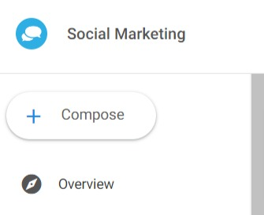

### **How to Post Videos to LinkedIn in Social Marketing**

To begin posting videos to LinkedIn, compose a post in the Social Marketing product by clicking the "Compose" button in the top left corner:

Click "Add Media," and drag and drop your **MP4 video file** in the upload window, or, click "Choose an Image or Video to Upload":

You should see your video populate under the "Media" section below the Content box. On the right-hand side, you can see your video preview for LinkedIn:

Please make sure to adhere to the following video file size specifications:

- **Length: Three seconds to 30 minutes**
- **File size: between 75KB and 200MB**
- **File format: MP4**

Now you're ready to post! Hit "Post now" or schedule your post for later. Not quite ready? Click "Save draft" and edit it under **Posts > Drafts.**