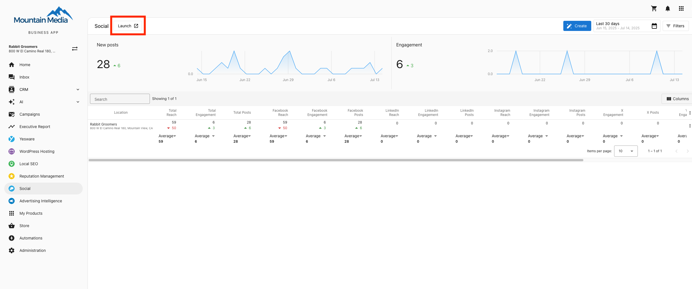
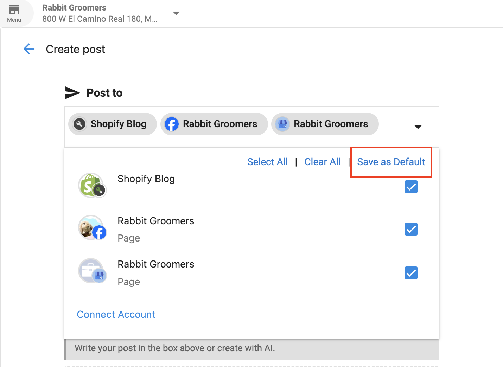
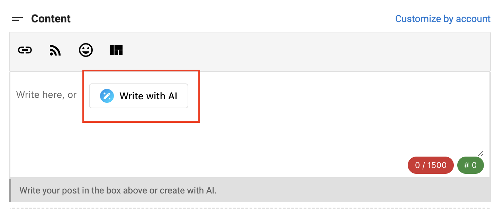
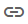

# Posting Content to Social Marketing

Social Marketing allows you to create and share content to your business's social accounts. This guide will walk you through the process of creating and publishing social posts.

## Accessing Social Marketing

Access Social Marketing from Business App:

1. Navigate to Social in the sidebar
2. Click the "Launch" button to open Social Marketing

3. Click on the **Create** button to start creating content

## Creating a New Post

### Step 1: Select Accounts
Choose which social accounts you want to post to:

1. In the **Composer**, select the accounts you want to post to from the list in the drop down menu
2. You can set default accounts by clicking "Save as Default" if you plan to post to the same accounts regularly.

### Step 2: Compose Your Post

Create your post content using the text editor:

1. Type your message in the text editor
2. Format your text as needed using the available formatting tools
3. Add hashtags, mentions, or emojis to enhance your post

### Step 3: Add Media (Optional)

Enhance your post with images or videos:

1. Click the upload icon in the composer to add media
2. Select files from your device or use the provided media options
3. Preview how your media will appear in the post
4. **Note:** You must add media on Instagram posts

## Using Time-Saving Features

### AI Content Generation

Save time by using AI to generate post content:

1. Click the AI content generation icon in the composer
2. Choose a content type or enter a prompt
3. Review and edit the AI-generated content as needed

### Templates

Use templates to maintain consistent messaging:

1. Click the template icon in the composer
2. Choose from available templates or create your own
3. Customize the template content for your specific post

### Link Shortening

Shorten links to track engagement and save character space:

1. Paste your link into the composer
2. Click the link shortening icon
3. The link will be automatically shortened

### Content Sharing

Share curated content from the content library:

1. Click the content share icon
2. Browse available content by category
3. Select content to share and customize as needed

## Scheduling Your Post

Decide when your post should go live:

1. Choose whether to publish immediately, schedule for later, or save as a draft
2. For scheduled posts, select a date and time
3. Review scheduling options for optimal posting times based on audience engagement data

## Managing Posts

After creating posts, you can manage them from the Calendar or Posts tabs:

1. View all scheduled posts in the Calendar view
2. Edit, delete, or reschedule posts as needed
3. Monitor post performance metrics

## Best Practices

- **Consistency**: Maintain a regular posting schedule
- **Platform Optimization**: Adapt content for different social platforms
- **Engagement**: Ask questions and encourage interaction
- **Hashtags**: Use relevant hashtags to increase visibility
- **Analytics**: Monitor performance to refine your strategy