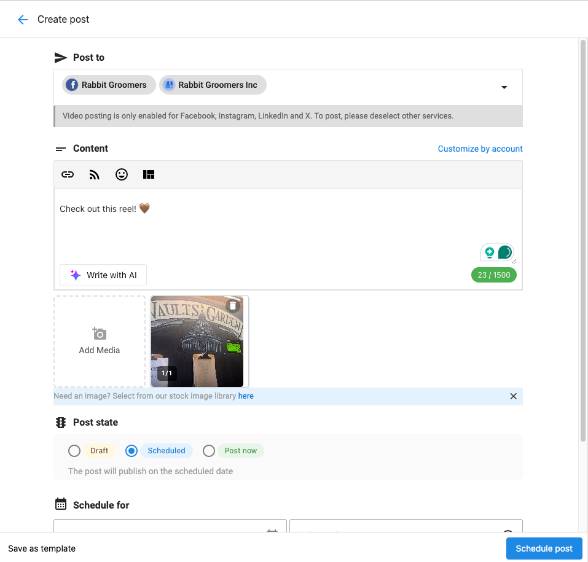

Social Marketing users can publish video content on Instagram.

Posts with video receive vastly more engagement than those without. By uploading videos, content will be more engaging, resulting in better traction and viewer interaction.

### **How does posting a video to Instagram work?**

Users can upload a .mp4 or .mov video that is a maximum of **60 seconds** in length through the Social Marketing composer.

**Videos posted through Social Marketing will automatically post as a Reel.**

To learn more about Instagram Reels through Social Marketing, click **[here](/vendasta-products/vendasta-products-social-marketing/vendasta-products-social-marketing-posts/instagram-reels).**

Once uploaded you will be able to publish or schedule the video post.

Social Marketing users will be able to post videos to both Instagram and Facebook at the same time.

**Note**: There is currently no functionality to allow for choosing a video thumbnail through Social Marketing.