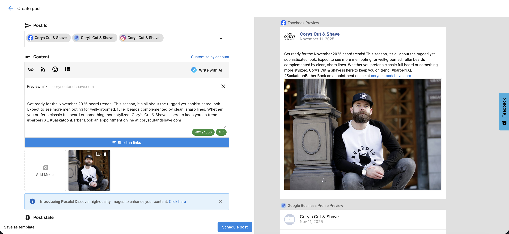
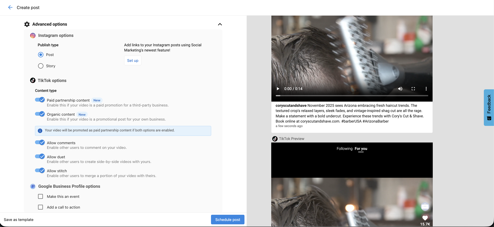
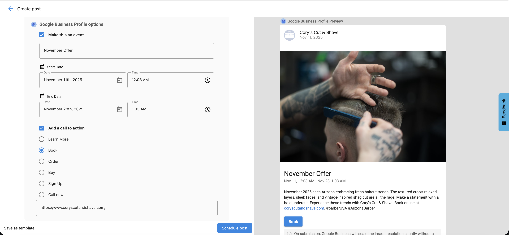
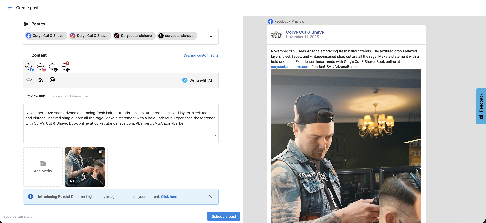
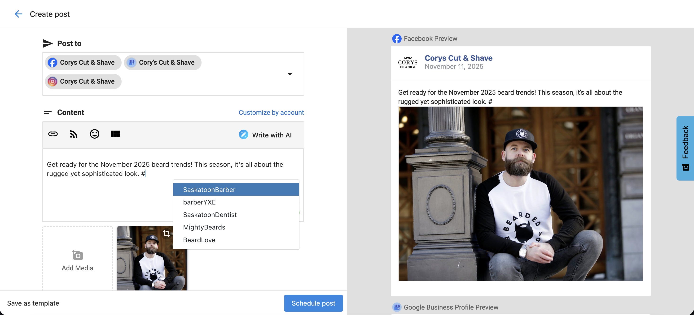
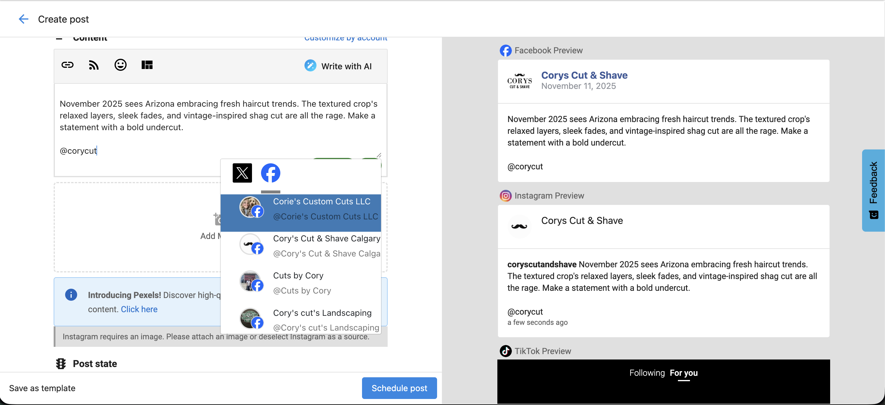
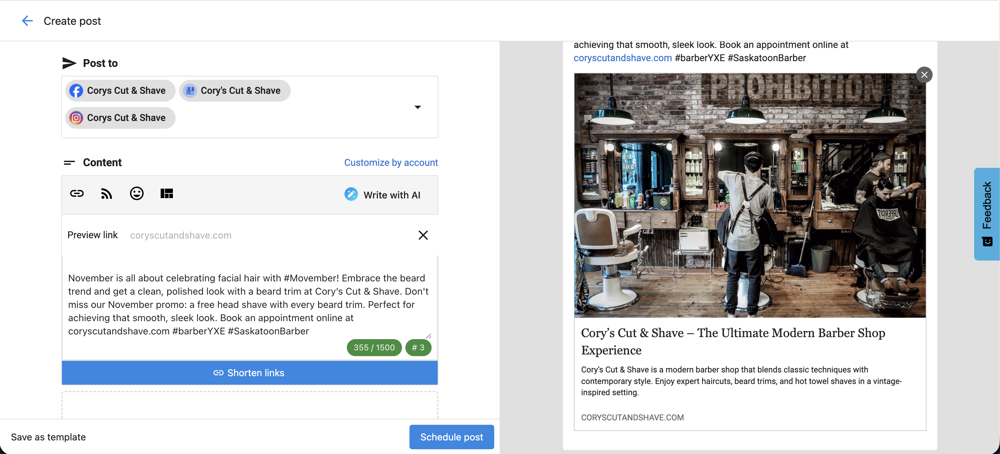

## What is the Social Marketing Composer?

The **Social Marketing composer** helps you create, schedule, and manage social media content across multiple platforms in one place. Whether you are posting a single update or running a campaign, the composer provides the tools you need to customize each post for every network.

## Why is the composer important?

This tool allows you to:

- Publish to multiple social accounts at once  
- Customize content for different platforms  
- Schedule posts in advance or save them as drafts  
- Ensure each post meets platform requirements and limits  
- Improve writing quality with grammar tools  

## How to compose a post

1. Go to `Social Marketing`.  
2. Click `compose` or `create`.  
3. **Choose Social Accounts** under the `post to` section.  
   - You can select multiple social accounts across platforms.  
   - Only **one X (Twitter)** account can be selected per post due to X’s publishing rules.  
   - Posts cannot be scheduled or published to **expired accounts**.  
4. **Write content** under the `content` field:  
   - Use `write with AI` to generate post text.  
   - Shorten links to track performance or fit character limits on X (Twitter).  
   - Add emojis, hashtags, or tagged accounts.  
   - Insert content from RSS feeds or curated sources.  
   - Save posts as templates for future use, or apply existing templates.  
   - Use `customize by account` to adjust text for different platforms.  
5. **Add media**  
   - Upload your own images or videos.  
   - Use `stock imagery` or `generate image with AI`.  
   - Instagram requires an image; TikTok requires a video.  
6. **Schedule or publish**  
   - Choose `post Now`, `schedule`, or `save as draft`.

## Platform-specific options

### Instagram
- Choose between `post` or `story`.

### TikTok
- **Paid partnership content** – Enable if promoting a third-party business.  
- **Organic content** – Enable if promoting your own business.  
- **Allow comments**, **duet**, or **stitch** – Choose how others can interact with your video.

### Google Business Profile
- Add a **call to action (CTA)**:
  - `Book` – Invite users to book an appointment.  
  - `Order` – Link to an ordering page.  
  - `Shop` – Encourage browsing a catalog.  
  - `Learn more` – Provide more details on a linked page.  
  - `Sign up` – Prompt users to register or join.  
  - `Call` – Add a clickable phone number.  
- Add a **start date** and **end date** to make it an event.

:::warning
Google Business Profile posts must include a CTA. If no CTA is added, the post will fail to publish.
:::

## Grammar and spell check tools

The composer supports grammar and spell-check extensions such as:

- Grammarly  
- Microsoft Editor  
- Quillbot  

These tools help ensure your posts are accurate and professional.

## Character limits by platform

| Platform | Character limit |
|-----------|-----------------|
| Facebook | 63,206 |
| X (Twitter) | 280 (Standard) / 25,000 (Premium) |
| LinkedIn | 3,000 |
| Instagram | 2,200 |
| TikTok | 2,200 |
| Google Business Profile | 1,500 |

:::warning
HTML is not supported in the composer.
:::

## Customize by account

Each social network has different requirements. Use `customize by account` to:

- Adapt content automatically to match platform limits  
- Avoid errors with image size or video length  
- Tailor tone, hashtags, and visuals for each network  

## Editing drafts and scheduled posts

1. Go to `Social Marketing` → `posts` → `drafts` or `scheduled`.  
2. Click `edit` to make changes to text, media, or posting date.  
3. Use `customize by account` to update specific platform versions.  

:::info
If a social account disconnects, scheduled posts are automatically saved as drafts.  
Reconnect the account, go to `posts` → `drafts`, click `edit`, and select `schedule post`.
:::

## Hashtags and tagging

### Hashtags
- Type `#` in the composer to view recent hashtags.  
- Start typing to see autocomplete suggestions or add new ones manually.  
- Frequently used hashtags are remembered for next time.

### Tagging
- Tag other accounts on **Facebook (business pages only)** and **X (Twitter)** by typing `@` followed by the account name.  
- Use tagging strategically to increase visibility and engagement.

## Link previews

When you add a URL:

- **Facebook, LinkedIn, and X (Twitter)** support link previews with image and title.  
- **LinkedIn** allows preview image selection.  
- **Instagram** and **Google Business Profile** do not support link previews.  
- Google Business Profile allows CTAs (e.g., `Learn More`, `Book`, or `Order`) that include clickable links.

## Bulk posting limits

| User type | Max scheduled posts |
|------------|---------------------|
| Standard | 20 |
| Pro | Unlimited |

## Platform posting limits

Facebook and Instagram allow **up to 25 API-published posts per 24 hours** per account.  
Exceeding this limit may trigger spam detection, reduce reach, or result in account restrictions.

## Frequently asked questions (FAQs)

How far in advance can I schedule posts?

You can schedule posts as far ahead as **December 31, 9999**.

Which platforms support link previews?

Facebook, LinkedIn, and X (Twitter).  
Instagram and Google Business Profile do not, but Google posts can include clickable CTAs.

What happens if a social account disconnects?

Scheduled posts are saved as drafts until the account is reconnected.

Can I customize content per network?

Yes. Use `customize by account` to edit versions for each platform.

Why use grammar tools?

They help maintain a professional image by preventing spelling and grammar mistakes.

Can I tag other businesses?

Yes. Use `@` on Facebook or X (Twitter) to tag business pages or profiles.

Do hashtags improve reach?

Yes. Hashtags help users discover your posts and can increase engagement.

Can I include CTAs in Google posts?

Yes. You must include a CTA for your post to publish successfully.

