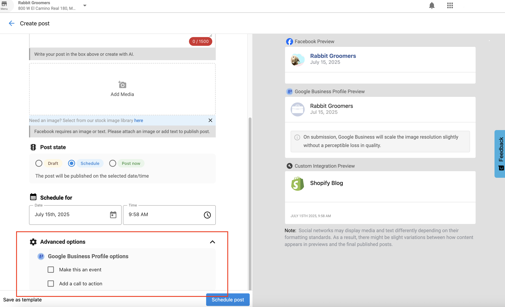
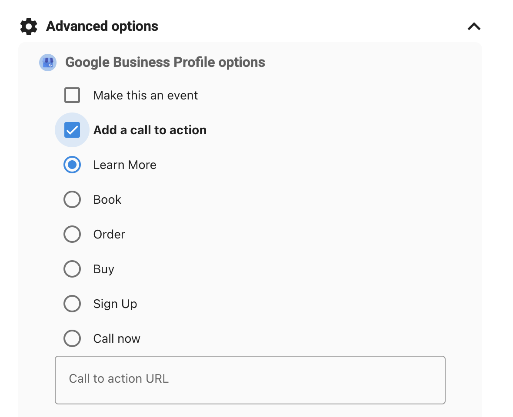
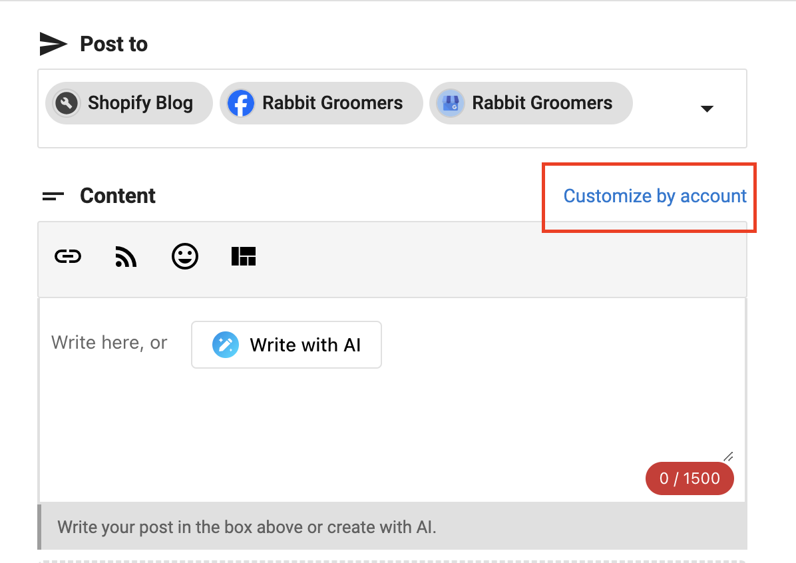

# Posts Overview

Creating and managing social media content across multiple platforms is easy with the Social Marketing Composer. Whether you're crafting a simple status update or planning a multi-platform campaign, the tools available make it efficient, accurate, and tailored to every platform's needs.

## Getting Started: Composing a Post

You can begin composing a social post by clicking **Compose** or **Create** on the Posts page.

### Steps to Compose a Post:

1. **Choose Social Accounts** – Select the accounts you want to post to under the **Post to** heading.
2. **Write Content** – Add your message under **Content**. You can:
   - Use **AI assistance** to generate post content.
   - **Shorten links** for platforms like X (formerly Twitter).
   - **Insert emojis** to add personality.
   - Use **RSS feeds** and curated content tools to find relevant material.
   - **Save posts as templates** for future use.
3. **Add Media** – Upload images or videos. _Instagram requires an image._
4. **Schedule or Publish** – Choose to **Post Now**, **Schedule**, or **Save as Draft**.
5. **Customize for Google Business Profile** (optional):
   - **Add a call to action (CTA)** like “Learn More.”
   - **Make it an event** to appear in Google search results.

## Grammar and Spell Check Tools

To improve the quality of your posts, the Composer integrates with:

- **Grammarly**
- **Microsoft Editor**
- **Quillbot**

These tools help prevent typos and ensure professional, error-free writing.

## Character Limits by Platform

The Composer automatically enforces character limits based on the selected networks. Here's a quick reference:

| Platform                | Character Limit |
|-------------------------|-----------------|
| Facebook                | 63,206          |
| X (Twitter)             | Standard 280  / Premium - 25,000           |
| LinkedIn                | 1,300           |
| Instagram               | 2,200           |
| Google Business Profile | 1,500           |

⚠️ Note: Composer does not support HTML.

## Network Validations & Customization

Each social platform has its own rules. With **“Customize by Account”**, you can:

- Automatically adapt each post to platform requirements.
- Avoid formatting errors (image size, video length, character count).
- Fine-tune messaging and visuals for each network.

## Editing Scheduled Posts

Need to make changes before a post goes live?

1. Go to **Social Marketing > Posts > Scheduled**
2. Click **Edit** to change text or media.
3. Use **Customize by Account** to modify individual versions for each platform.

## Enhance Reach with Hashtags and Tagging

### Hashtag Autocomplete

Type `#` in the composer to access your most recently used hashtags. Start typing for suggestions or add new hashtags manually. These will be remembered for next time.

### Tag Other Accounts

Tag businesses on:

- **Facebook** (Business Pages)
- **X** (Business Profiles or Personal Users)

Simply type `@` followed by the business name. Tagging can increase post visibility, but use it strategically—such as during partnerships or shared events.

## Link Previews

When you add a URL:

- **Facebook, LinkedIn, and X** support link previews (image + title).
- **LinkedIn** allows preview image selection.
- **Instagram** and **Google Business Profile** do not support link previews.

> However, Google Business Profile allows adding a **CTA button** with a link (e.g., “Learn More”).

## Draft to Schedule Conversion

If a connected social account is disconnected, scheduled posts are saved as drafts. Once reconnected:

1. Go to **Posts > Drafts**
2. Click **Edit**
3. Review the scheduled date
4. Click **Schedule Post**

## Bulk Posting Limits

- **Standard users** can schedule up to **20 posts** at once.
- **Pro users** can schedule **unlimited posts**.

---

## Frequently Asked Questions (FAQ)

How far in advance can I schedule a post?

You can schedule posts as far ahead as **December 31, 9999**.

Which platforms support link previews?

**Facebook**, **LinkedIn**, and **X (Twitter)**.  
**Instagram** and **Google Business Profile** do not, but Google allows clickable CTAs.

Can I add a CTA to Google posts?

Yes!
1. Create a new post in Social Marketing
2. Select Google Business Profile as your network
3. In the post composer, look for the **Advanced options* section and select **Add a call to action**

4. Choose from available CTA options:
- **Learn More:** For linking to more information 
- **Book:** For appointment booking links
- **Order:** For links to order products and services
- **Buy:** For ecommerce links 
- **Sign Up:** For users to sign up for mailing lists, newsletters, etc. 
- **Call Now:** For phone numbers 

**Note:** Google Business Profile posts **must** include a CTA, or the post will fail to go live.

What happens to scheduled posts if an account disconnects?

They are saved as **drafts**. Reconnect the account, then go to **Posts > Drafts** to edit and reschedule.

Can I customize each post per network?

Yes. Use **Customize by Account** to adjust copy and media to fit each platform's format and style.

Why are spell check tools important in social posts?

Well-written posts reflect a **professional image**. Spelling and grammar mistakes can harm a business's credibility.

What's the benefit of using hashtags in posts?

Hashtags can boost post performance by **up to 12%**, increasing visibility and engagement.

Can I tag other businesses?

Yes—on **Facebook** and **X**. Use `@` in the post copy to tag other accounts.

How many times can I post on Instagram and Facebook per day?

As per Facebook's API, Instagram and Facebook Accounts are limited to 25 API-published posts within 24 hours. Instagram may flag you as a spam account, and posting over the limit of 25 can trigger Instagram's API into thinking that your account has been hacked. It can result also result in a decreased reach and eventually being banned from the platform.

