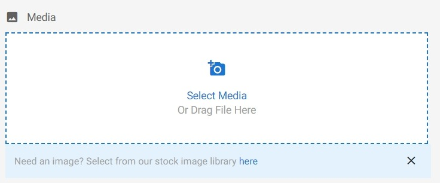
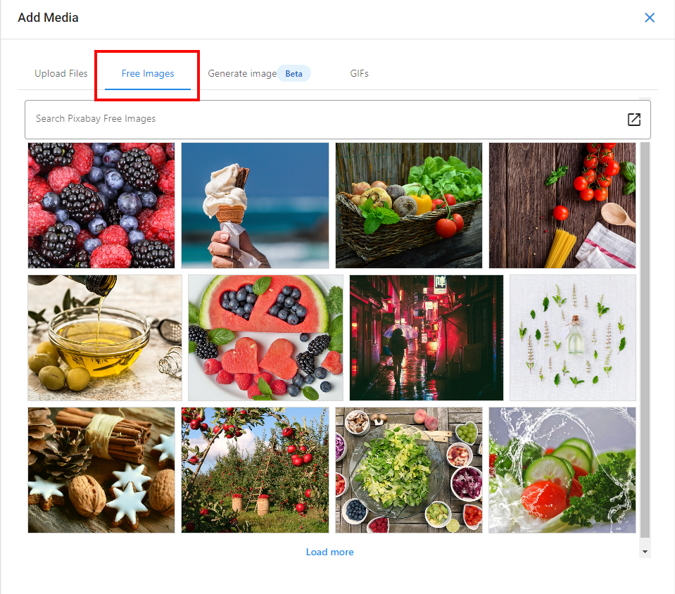

# Royalty-Free Image Integration

The Social Marketing composer offers the option to add royalty-free images from Pixabay to posts.

Posts with images perform significantly better than those without. Pixabay integration makes it easier to find images for posts without having to worry about the legality of those images. This will save the time of hunting down images, saving them to your computer, then uploading those.

### How does royalty-free image integration work?

1. From **Social Marketing > Create**, scroll down to the Media section and click on **Add Media**.
   

2. Click **Pixabay**, then search for a relevant keyword.
   

3. Select the image you wish to use. This will add the image to your post.

This feature is available to all users of Social Marketing.