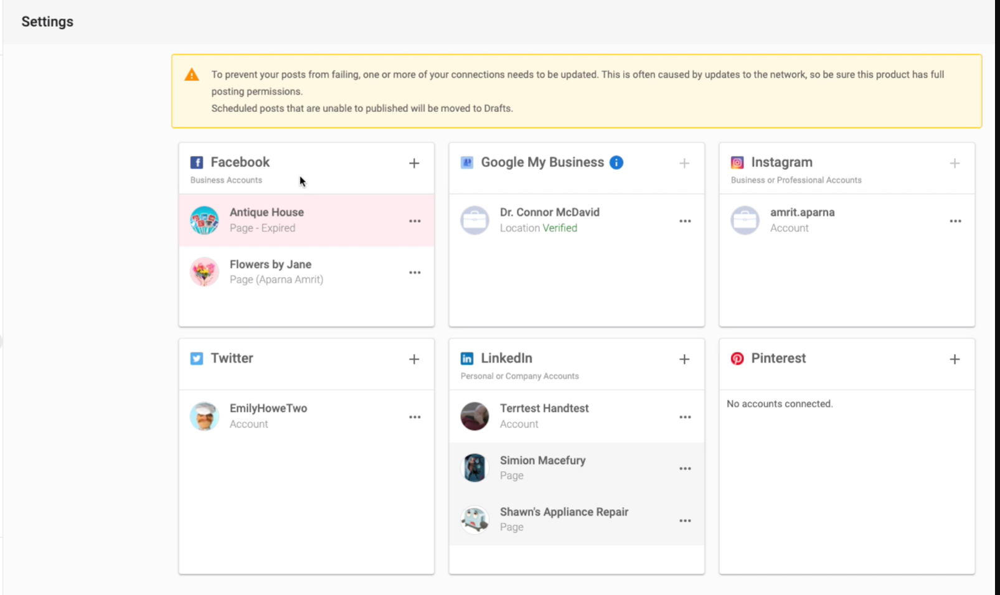
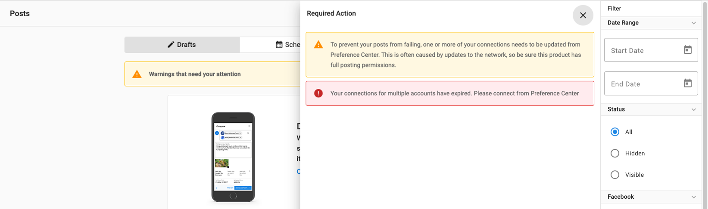

As part of security measures to protect your social accounts, each social network's connections in Social Marketing may expire. A few reasons behind this connection expiry may be a change in the admin user access or password for that account. This is sometimes referred to as a "broken token" error.

When a social network connection expires, all scheduled posts for that network will now be automatically saved as drafts if the account is not reconnected by the scheduled date. This means that if an account connection expires, you or your clients won't lose the content of your scheduled posts. Simply reconnect the account and reschedule your posts when you're ready.

### What happens when a social connection expires?

When a social connection expires, you will see a banner informing you that one or more of your connections need to be updated.

Under **Settings > Connect Accounts**, the expired connection will be highlighted in red and you will see text indicating that it is Expired.

### What happens to my scheduled posts when a social connection expires?

Under the **Posts** tab, you will be able to see which posts are affected by the expired connection. You will see a warning message. Click **View Warnings** to see the specific issue. Posts will automatically be sent to drafts if the connection is not repaired before the post is scheduled to be published.

- If your scheduled post is set to go out to multiple networks, the post will still be published on the social networks that have an active connection.
- If you can reconnect your social account successfully before the scheduled date for your posts, these will be published successfully.
- If you are not able to reconnect your social account by the scheduled date for your post, it will automatically be sent to Drafts where you can easily edit and reschedule once your account has been reconnected.

### How do I reconnect an expired account?

1. Update your connections based on the error message, and try clicking **Repost.**
2. To update connections, navigate to **Settings > Connect Accounts.**
3. **Click ⋮ (Options)** on the affected account, and click Reconnect.
4. If a user has been removed or had their permissions changed, remove the affected user or page and [reconnect](/vendasta-products/vendasta-products-social-marketing/connecting-social-accounts) the page under a different admin.

**Note: The scheduled posts cannot be recovered if the product is deactivated.**

[Learn more about connecting social accounts →](/vendasta-products/vendasta-products-social-marketing/connecting-social-accounts)