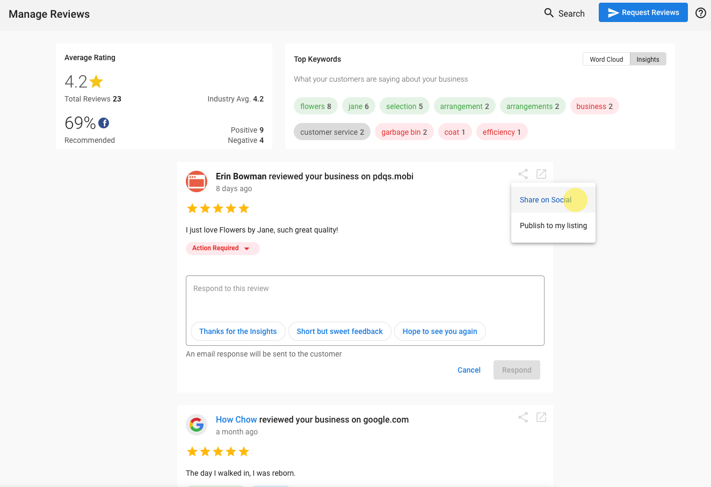
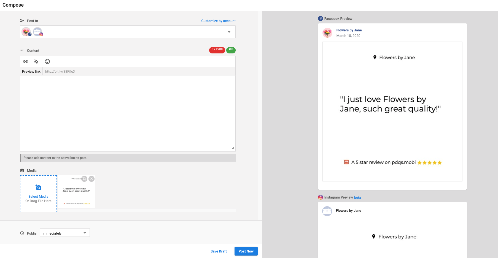

# Share Reviews as Social Post Images

Users of both Reputation Management and Social Marketing can share reviews pulled in through Reputation Management as images in Social Marketing.

Reviews can make or break a business. By sharing positive reviews from satisfied customers, you are able to better showcase and prove your business's abilities. Fans of your business are more likely to interact with an image in comparison to clicking a link and reading a review on a third-party site.

### How to share reviews as social posts

In Reputation Management, when you would like to share a positive review, you can easily click the share button and select "Share on Social".

This will take you into Social Marketing and pre-populate the composer with an image showcasing the review.

All users of both Reputation Management and Social Marketing have access to this feature.