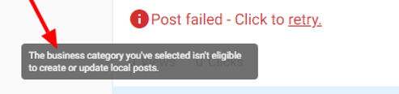
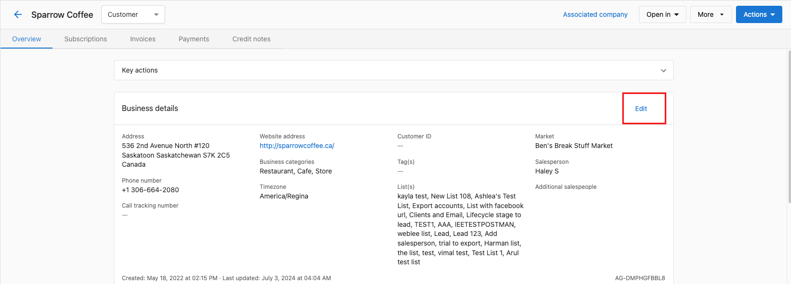

If you receive this error message, you need to update your Business Category under the account page through Partner Center > Edit.

The following businesses are restricted:

1. Adult Entertainment
2. Camp
3. Cannabis shop
4. Casino
5. Conference Center
6. Gun Shop
7. Hotel (all hotel categories)
8. Vacation Rental
9. Wine Store (and other alcohol-related categories)

Please refer to the Google Guidelines on Eligible and Ineligible businesses to know which categories are/aren't supported: [https://support.google.com/business/answer/3038177?hl=en](https://support.google.com/business/answer/3038177?hl=en).