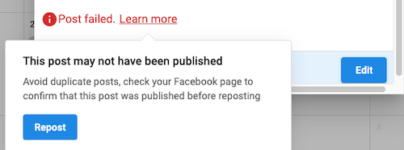

# Social Error messages

We're hard at work improving the Social Marketing experience. While errors can't always be prevented, we want to make them as easy to resolve as possible.

We'll continue improving error messages in Social Marketing. For those that want a few more details, however, you can follow this article to receive updates each time these messages are improved.

## Error Message Reference Table

| Source | Previous message | Updated message |
| :---: | :---: | :---: |
| **X** | This request looks like it might be automated. To protect our users from spam and other malicious activity, we can't complete this action right now. Please try again later. | The X account may have been temporarily locked, blocking Social Marketing from creating any posts. You may visit this [X](https://help.twitter.com/en/managing-your-account/locked-and-limited-accounts) page for help troubleshooting. |
| **X** | This X account has been locked. Please log in to https://x.com to unlock. | We couldn't publish this post because your X account has been locked. X may temporarily lock an account if they detect behavior that violates X Rules or Terms of Service. To restore your account and continue posting, sign in to x.com directly. |
| **Instagram** | (#10) Application does not have permission for this action | You haven't given this app permission to post to this Instagram account. Update your permissions by editing your Facebook and Instagram connections. |
| **Instagram** | You must be an Admin or Editor on the associated Facebook page to add this page.

Your Instagram account may not be properly connected to a Facebook Page.
1. Review your Instagram account's connections under "Instagram Settings" on the Facebook Page you want linked
2. Confirm that you've granted Social Reputation integration permissions under "Business Integrations" in your Facebook Page settings. | To connect an Instagram account in Social Marketing you must first [connect the account to a Facebook Page](/vendasta-products/vendasta-products-social-marketing/connecting-an-instagram-account-to-a-facebook-page) |
| **Instagram** | (#10) The user is not an Instagram Business | Your connected Instagram account is not a Business account. Convert your account to a Business account, then reconnect. |
| **Instagram** | The token is broken for User | Your Instagram connection has expired. Reconnect your account to post to Instagram. |
| **LinkedIn** | `{"serviceErrorCode":65602,"message":"The token used in the request has expired","status":401}` | LinkedIn requires you to refresh your connection every 60 days. To post, refresh your connection. |
| **X** | Invalid or expired token. | Your X connection needs to be updated. This can be caused by changing your login details or revoking access via X. To post, update your connection. |
| **Facebook** | `"error": {"message":"Error validating access token: The user has not authorized application 94409704895."}` | Your Facebook connection needs to be updated. This can be caused by changing your login details or revoking access via Facebook. To post, update your connection. |
| **X** | Error when getting upload status failed | Your video file could not be processed. Please follow the video requirements in order to post. |
| **Google Business Profile** | GBP post failed, 400 error - "Request contains an invalid argument" with validation errors for call_to_action.url | The link you have entered is invalid. |
| **Facebook** | `{"error":{"message":"Unsupported post request.","type":"GraphMethodExceprtion","code":100}}` | Something went wrong when posting to Facebook. Try reposting, and if that fails, recreate the post. |
| **Facebook** | `Not intuitive message ( :{"error":{"code":1,"message":"An unknown error occurred","error_subcode":99}})` |  |
| **Facebook** | Error: Your content couldn't be shared, because this link goes against Community Standards | We can use [Facebook's link debugger](https://developers.facebook.com/tools/debug/) to verify if the links included in the failed post are against [FB's community guidelines](https://transparency.fb.com/policies/community-standards/?from=https%3A%2F%2Fwww.facebook.com%2Fcommunitystandards). If it is, we advise you to review the guidelines set by Facebook and if you think that Facebook made a mistake, then you can reach out to [Facebook](https://www.facebook.com/help/contact/571927962827151?additional_content=AegK6RiJoKKcmCK1stMI06D8FEtwKK4GjGkw_z5ZCRhd1FCu1fCCTJz16qCWCe1ZXKKS7zdpQWYDI_U4tDjqqjJwXJWY5DDZy0Q0z86-W8rhZHt8QUNktmZYRKZzj7dz26YboZJIdM1wj-TGo5LvhXbVjENNb28MUGU6Ckk1luaS9ChvymcnrfFmzjGaf3lfc_E9blIhqzmMMFd7Rr6ydfadZ54Tp8_BooI49AhwAvrKuID05c3gsfOcK0nsMuA_6gE3oikauljDUBbevhkLJGB9X_p1oXtdKWlulU0peFH5KMPG88mPY3dupoXQOsi0hZ89pIiYlElyBjrZrqxM024uLUUJKT2stvjxVZJRnLGt6A) for further assistance. |
| **Instagram** | The Instagram account is restricted. | Your Instagram account requires your attention. Log in to Instagram and follow their instructions. |
| **Instagram** | (#263) You cannot post to your connected Instagram account until you complete Page Publishing Authorization. Please visit [https://www.facebook.com/business/...](https://www.facebook.com/business/m/one-sheeters/page-publishing-authorization) for more information. | To post, you must complete Page Publishing Authorization for your Instagram account. See Facebook's Help Center for more information. |