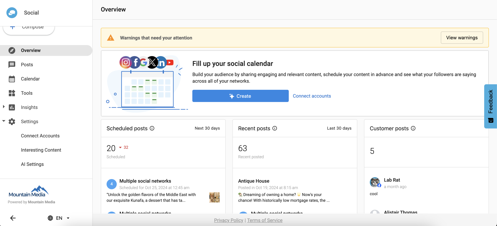
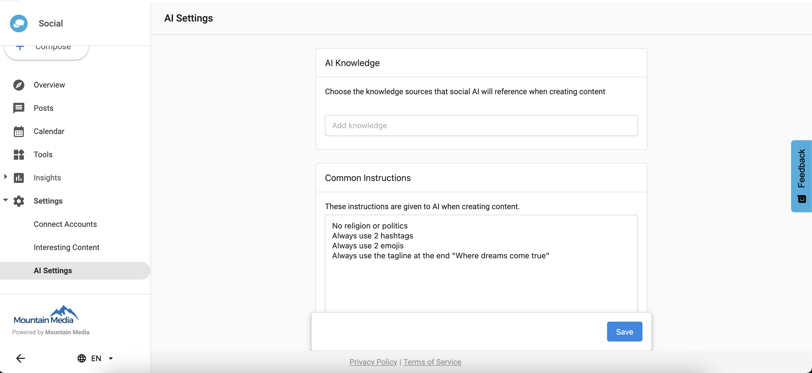
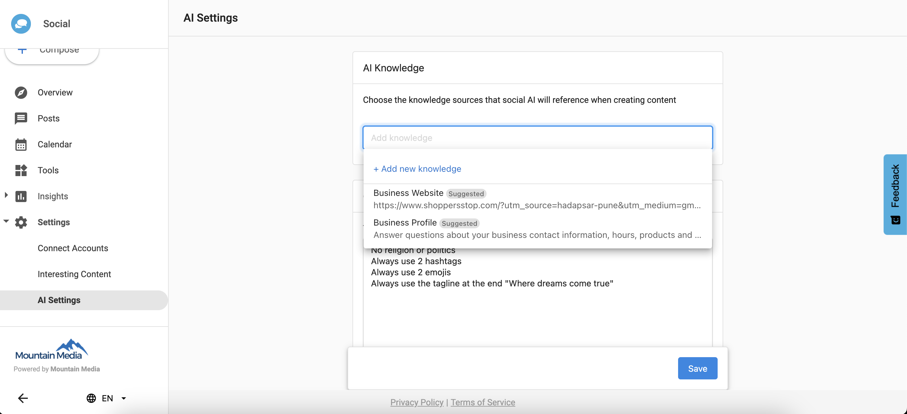
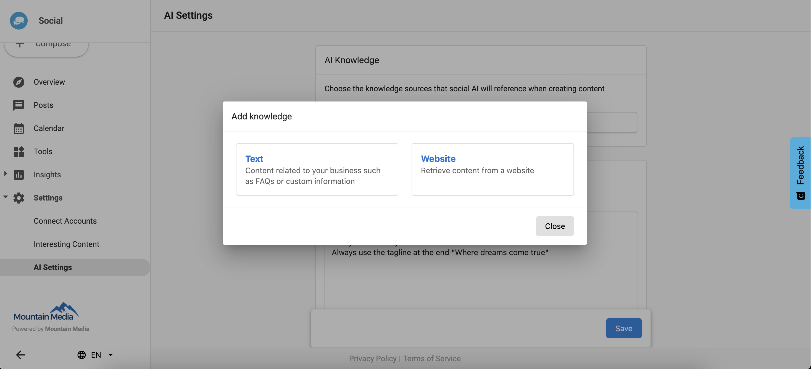
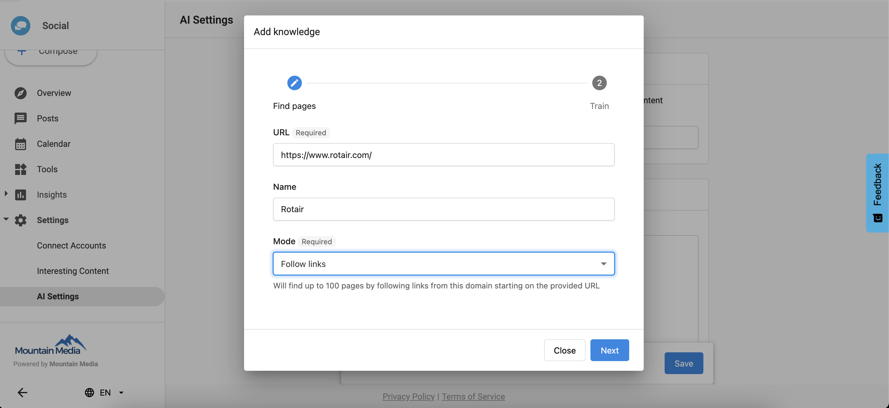
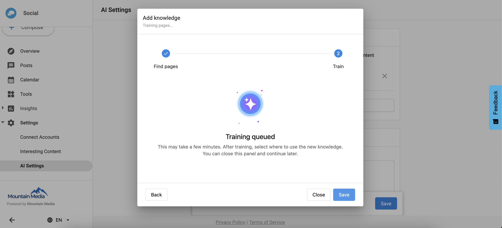
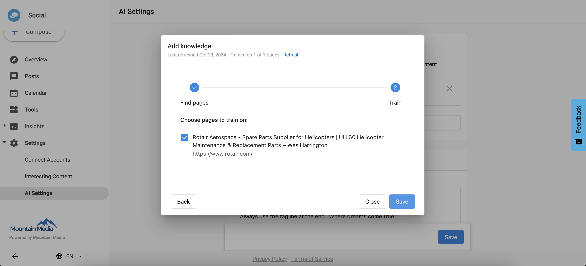

# AI Knowledge in Social Marketing Pro

AI Knowledge allows the ChatGPT conversation to include information from a document, a website, or a social profile, providing more contextual responses tailored to your business.

## Accessing AI Knowledge

To access AI Knowledge:

1. Go to Settings
2. Click on the **AI Settings** tab

## Adding Documents

You can add documents to your AI Knowledge base that ChatGPT can reference when generating content.

1. Click **+ Add** to upload a document
2. Choose a document from your computer to upload

Supported file formats: PDF, DOCX, XLSX, CSV, TXT

## Adding Websites

You can add websites to your AI Knowledge base for ChatGPT to reference.

1. Click the **Websites** tab
2. Enter a website URL in the field
3. Click **Add**

## Adding Social Profiles

You can add social profiles to your AI Knowledge base for ChatGPT to reference.

1. Click the **Websites** tab
2. Enter a social profile URL in the field
3. Click **Add**

## Utilizing AI Knowledge in Campaigns

When creating campaigns in Social Marketing Pro, ChatGPT can reference the knowledge base you've created.

1. Click on the **Campaigns** tab
2. Choose **Create New**
3. Input a prompt for ChatGPT
4. Enable the **Use AI Knowledge** toggle

## Managing AI Knowledge

You can manage your AI Knowledge items:

- Click the trash icon next to any item to delete it
- Add new items at any time through the respective tabs
- The system will index your documents and websites automatically

## Viewing AI Knowledge Responses

When generating content with AI Knowledge enabled, the system will:

1. Reference your knowledge base
2. Provide contextually relevant content
3. Show which sources it used at the bottom of the response

## Editing with AI Knowledge

After generating content, you can continue to use AI Knowledge during editing:

1. In the generated content screen, provide additional prompts
2. Keep the AI Knowledge toggle enabled for continued reference
3. Refine your content with knowledge-based inputs

## Best Practices

- Upload the most relevant and current documents
- Include your brand guidelines as a document
- Add your main website and relevant subpages
- Include social profiles that best represent your brand voice
- Be specific in your prompts when referencing knowledge

