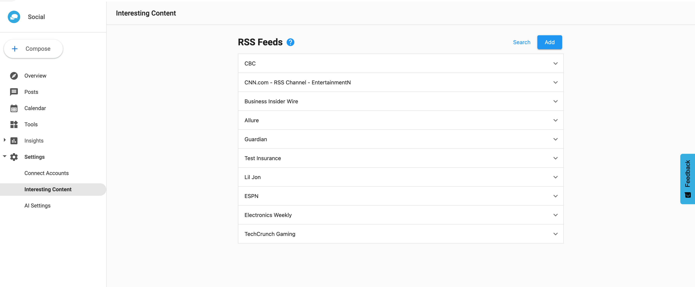
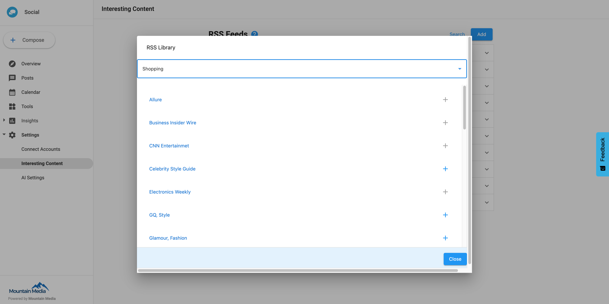

# Configuring Interesting Content

The **Interesting Content** feature in Social Marketing helps users find interesting articles to share with their social media audience. These are powered by RSS feeds–updated streams of articles powered by various sites across the internet.

### Configuring RSS feeds

You can either add a curated RSS feed or add your own.

### Using a curated RSS feed

1. From **Social Marketing > Settings > Interesting Content**, click **Search**.
   

2. Select a business category.

3. Click **+** next to any feeds you wish to add to your interesting content feed. You can click on the name of these RSS feeds to view the pages they are powered by.
   