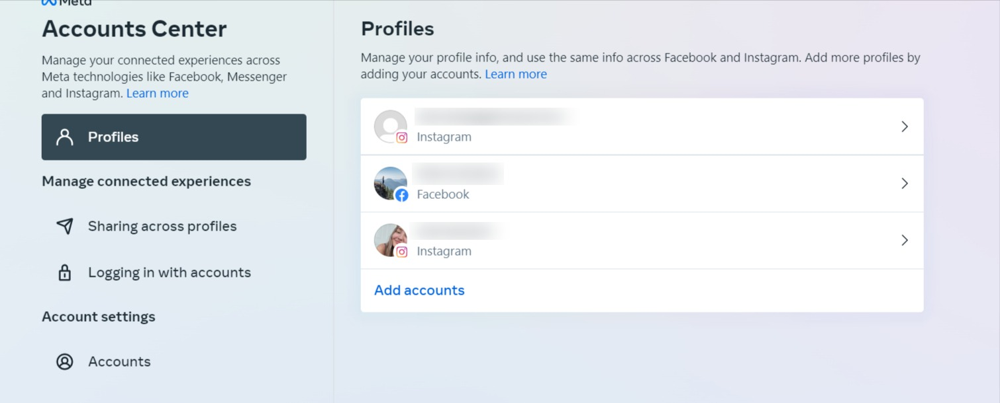

# Troubleshooting Facebook and Instagram Connection Errors

Facebook and Instagram accounts must be connected to Social Marketing in order for you to post and schedule content to these platforms. If you're experiencing connection issues, here are some common errors and solutions.

## Error: "Access has not been granted or has expired. Please reconnect to the Facebook pages and Instagram business accounts."

This error occurs when you try to post or schedule content to Facebook or Instagram, but your accounts aren't properly connected.

### Solution:

1. From your Business App, navigate to **Social Marketing**.
2. Click on **Settings** in the left navigation panel.

{/*  */}

3. Select the **Connections** tab.

{/*  */}

4. Look for Facebook in the list of platforms. If it's disconnected, click the **Connect** button.

{/*  */}

5. You'll be prompted to log in to Facebook and grant permissions.

{/*  */}

6. After connecting your Facebook account, you'll need to select which Pages and Instagram accounts you want to connect. Make sure to check all the Pages and Instagram accounts you want to manage.

{/*  */}

7. Once you've selected your accounts, click **Connect** to finalize the connection.

8. Your accounts should now be properly connected and you can post or schedule content.

## Error: "You do not have permission to create posts on selected social profiles. Please try again with different profiles."

{/*  */}

This error occurs when you're trying to post to Facebook Pages or Instagram accounts where you don't have the necessary permissions.

### Solution:

1. Make sure you're logged into the Facebook account that has admin permissions for the Pages and Instagram accounts you're trying to connect.
2. Check your Page roles for the Facebook Pages by going to the Facebook Page > Settings > Page Roles. You should have an Admin, Editor, or Moderator role.

{/*  */}

3. For Instagram accounts, make sure they are Business or Creator accounts and are connected to the Facebook Page that you have permissions for.

## Error: "The connected Facebook account has expired."

{/*  */}

This error occurs when your Facebook connection has expired, which can happen periodically due to Facebook's security protocols.

### Solution:

1. Go to **Social Marketing** > **Settings** > **Connections**.
2. Find Facebook in the list and click **Reconnect**.

{/*  */}

3. Follow the prompts to log in to Facebook and reauthorize the connection.

## Error: "Content cannot be posted to Instagram. Please make sure the connected Instagram account is a Business account."

{/*  */}

This error occurs because Social Marketing can only post to Instagram Business or Creator accounts, not personal accounts.

### Solution:

1. Convert your Instagram account to a Business or Creator account:
   - Open the Instagram app on your mobile device
   - Go to your profile and tap the menu (☰) icon
   - Tap Settings and privacy
   - Scroll down and tap Account type and tools
   - Select Switch to Professional account and follow the prompts

{/*  */}

2. After converting to a Business account, connect your Instagram account to a Facebook Page:
   - In the Instagram app, go to your profile and tap Edit Profile
   - Under "Public Business Information," tap Page
   - Select the Facebook Page you want to connect to your Instagram account

3. Once your Instagram account is a Business account and connected to a Facebook Page, reconnect it in Social Marketing:
   - Go to **Social Marketing** > **Settings** > **Connections**
   - Reconnect your Facebook account and select both the Facebook Page and the connected Instagram account

## Error: "Unable to find your Business Manager account."

{/*  */}

This error occurs when you're trying to connect to a Facebook Page that's managed by a Business Manager account, but the system can't find your Business Manager account.

### Solution:

1. Make sure you're logged into the correct Facebook account that has access to the Business Manager account.
2. Check if your Business Manager account is set up correctly by going to [business.facebook.com](https://business.facebook.com).
3. Make sure the Pages you want to connect are added to your Business Manager account.

{/*  */}

4. If you're using a Business Manager account, make sure you have the appropriate permissions in that account. You should have an Admin or Employee access to the Business Manager and Page permissions for the Pages you want to connect.

## Error: "You don't have permission to manage this Instagram account."

{/*  */}

This error occurs when you're trying to connect an Instagram account that you don't have the necessary permissions for.

### Solution:

1. Make sure the Instagram account is a Business or Creator account, not a personal account.
2. Ensure the Instagram account is connected to a Facebook Page that you have admin permissions for.
3. If you're managing the Instagram account through a Business Manager, make sure you have the appropriate permissions in the Business Manager account.

## Error: "The Instagram account is not connected to a Facebook Page."

{/*  */}

This error occurs because Social Marketing connects to Instagram accounts through their linked Facebook Pages.

### Solution:

1. Connect your Instagram account to a Facebook Page:
   - In the Instagram app, go to your profile and tap Edit Profile
   - Under "Public Business Information," tap Page
   - Select the Facebook Page you want to connect to your Instagram account

{/*  */}

2. Once connected, try reconnecting in Social Marketing.

## Error: "The Facebook Pages API returned an error: (#100) You do not have permission to perform this action."

{/*  */}

This error occurs when there's an issue with the permissions granted to Social Marketing when connecting your Facebook account.

### Solution:

1. Reconnect your Facebook account and make sure to accept all permission requests during the connection process.
2. If you're an admin of multiple Business Manager accounts, make sure you're connecting with the correct one that has access to the Pages you want to manage.
3. Check that your Facebook account has not been restricted or flagged for any policy violations.

## How to Ensure a Successful Connection

### Use the Correct Facebook Account

Make sure you're using the Facebook account that has admin permissions for the Pages and Instagram accounts you want to connect.

### Check Page Roles

You need to be an Admin, Editor, or Moderator of the Facebook Pages you want to connect.

### Verify Instagram Account Type

Only Instagram Business or Creator accounts can be connected for posting. Personal accounts won't work.

{/*  */}

### Accept All Permissions

When connecting your Facebook account, make sure to accept all permissions requested. Declining any permission may cause connection issues.

{/*  */}

### Keep Your Facebook Password Secure

If you change your Facebook password, you'll need to reconnect your account in Social Marketing.

### Check for Facebook Restrictions

If your Facebook account has been flagged for suspicious activity or policy violations, it might restrict third-party connections.

{/*  */}

### Business Manager Considerations

If you're using Business Manager to manage your Pages:

1. Make sure you have the appropriate permissions in the Business Manager account.
2. The Pages you want to connect should be added to your Business Manager.
3. You should have the necessary Page permissions within the Business Manager.

{/*  */}

### Two-Factor Authentication

If you have two-factor authentication enabled on your Facebook account, you'll need to enter the security code when connecting.

{/*  */}

### Browser Considerations

Sometimes connection issues can be related to browser problems:

- Clear your browser cache and cookies
- Try using a different browser
- Disable browser extensions that might be interfering with the connection process

{/*  */}

### Facebook Apps Settings

Check your Facebook Apps settings to make sure you haven't previously blocked or removed Social Marketing's access:

1. Go to Facebook > Settings & Privacy > Settings
2. Click on Apps and Websites in the left menu
3. If you see Social Marketing in the "Removed" section, you'll need to reconnect and grant permissions again

## Still Having Issues?

If you've tried all the solutions above and are still experiencing connection issues, try these steps:

1. Completely disconnect your Facebook account from Social Marketing:
   - Go to **Social Marketing** > **Settings** > **Connections**
   - Find Facebook and click **Disconnect**

{/*  */}

2. Go to your Facebook settings and remove the Social Marketing app:
   - Go to Facebook > Settings & Privacy > Settings
   - Click on Apps and Websites
   - Find Social Marketing and remove it

{/*  */}

3. Clear your browser cache and cookies, or try using a different browser
4. Wait a few minutes, then try connecting again from scratch
5. If you're still experiencing issues, check if there are any known Facebook API outages or maintenance that might be affecting connections

{/*  */}

If none of these solutions resolve your connection issues, please contact support for further assistance.

{/*  */}