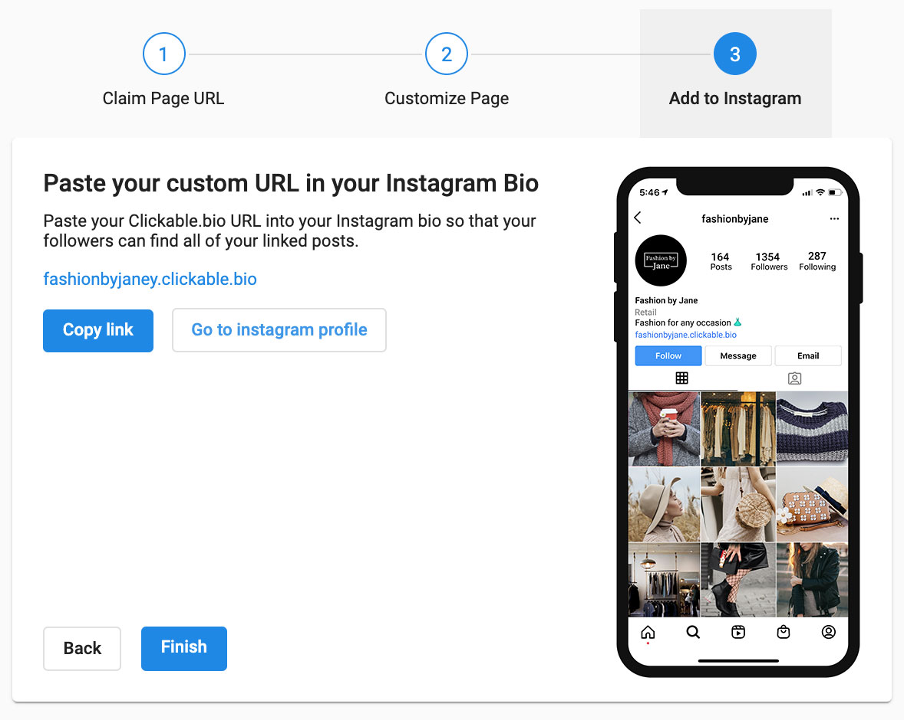

# Clickable.bio for Instagram

Clickable.bio for Instagram is a feature for **Social Marketing Pro** that helps clients drive traffic from their Instagram gallery to their website or online store. This enables businesses to capture more qualified leads, convert them to customers, and grow. Clickable.bio transforms Instagram posts into a gallery of images that link directly to the client’s site or shop.

## Why is Clickable.bio important?

The goal of any marketing initiative is to increase revenue. Social media offers a cost-effective way to drive traffic to your client’s site or store, capturing and converting leads into customers to boost sales.

Instagram boasts the **highest user engagement rate** among social platforms. In fact, **83% of users** discover new products and services on Instagram. However, users are easily distracted by other content. Without a simple way to guide followers to a client’s website, they may turn to competitors instead.

With **Social Marketing Pro’s Clickable.bio**, you can direct followers from Instagram to your client’s site for key actions like:

- Purchasing a product  
- Booking an appointment  
- Filling out a lead form  

## How does Clickable.bio work?

Clickable.bio turns Instagram posts into a **clickable gallery** of images that drive engagement and transactions. It’s available **for free** with any Social Marketing Pro account.

### Steps to Set Up:

1. Set up your Clickable.bio page  
2. Compose an Instagram post  
3. Review FAQs  

---

## Set up a Clickable.bio Page

Ensure your Instagram account is connected to **Social Marketing**:

- Navigate to: Settings > Connect Accounts
- Your Instagram must be connected to a **Facebook page**  

Then:

- Go to: Tools > Clickable.bio  
- Click **Set up** to begin in three simple steps  

### Step 1: Claim Clickable.bio URL

- This is the URL you’ll place in your Instagram bio  
- Format: businessname.clickable.bio (e.g., fashionbyjane.clickable.bio)  
- You can edit or change the URL later  
- Click **Next** to proceed  

### Step 2: Customize Your Clickable.bio Page

Users who click your bio link will land here. Fill in these details:

- **Business name** — displays at the top  
- **Profile image** — we recommend using your Instagram profile image  

#### Add a Button (Optional)

- **Yes**  
  - Add button text (e.g., “Visit website”)  
  - Enter your website URL and save  
- **No**  
  - No button will be shown  

Click **Next** to continue  

### Step 3: Paste URL in Instagram Bio

1. Click **Copy link**  
2. Click **Go to Instagram Profile** (opens new tab)  
3. On Instagram:
   - Click **Edit Profile**
   - Paste the URL in the **Website** field  
4. Return to Social Marketing and click **Finish**

🎉 **Congratulations! Your Clickable.bio Page is live.**

---

## Compose an Instagram Post

You can create a post in two ways:

- Sidebar > **Compose**  
- Tools > Clickable.bio > Compose a post 

### Posting Tips

- Select your Instagram account  
- Add a caption (include a reminder like “See link in bio”)  
- Use the **Instagram Options** section to add a URL  

After publishing or scheduling, the Clickable.bio page updates automatically. Now, when users tap your bio link, they’ll see a clickable image that redirects them to the associated link.

---

## FAQs

**Q: Can you add website links to previously published Instagram posts?**  
A: Only after Clickable.bio setup. You can add links to new posts moving forward.

**Q: Can you edit website links for published Clickable.bio posts?**  
A: Not currently, but this will be available in the future.

**Q: Can you use shortened URLs?**  
A: Yes, any type of website link is supported.

**Q: Can you change your Clickable.bio URL?**  
A: Yes. Go to **Tools > Clickable.bio > Appearance and Settings** to change it.

**Q: Will Clickable.bio affect a business’s SEO?**  
A: No. The page isn’t crawled by search engines.

**Q: What happens if a business disconnects Instagram?**  
A: The Clickable.bio page is saved until the account is reconnected or data is deleted.

