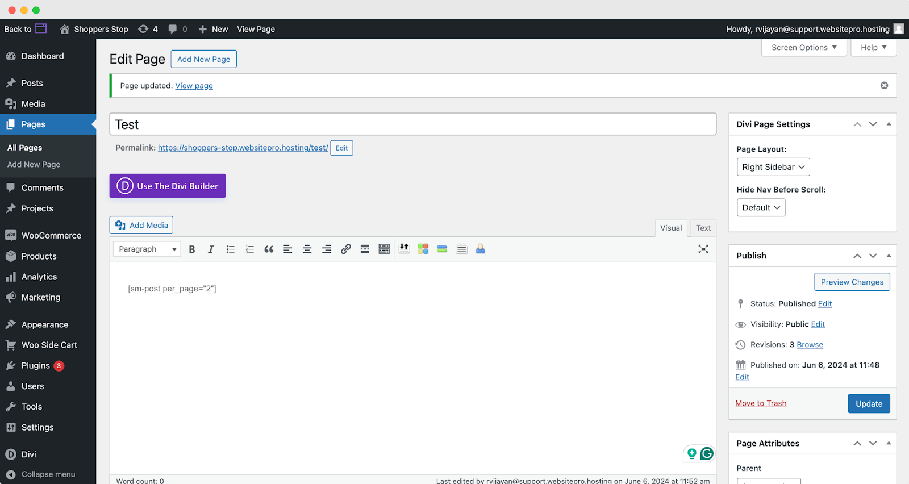
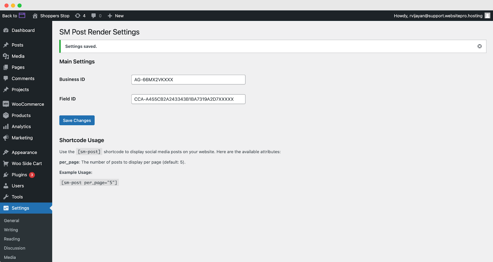

## What is the Social Marketing Post Render Plugin?

The Social Marketing Post Render plugin allows you to display social media posts from your business directly on your WordPress website. With a simple shortcode, you can fetch and render posts, making it easy to keep your website updated with the latest social media content.

## How to use the Social Marketing Post Render Plugin

1. **Prerequisites:**
   - WordPress - 6.5
   - PHP - 7.4
   - **Note:** This plugin has been tested on the mentioned versions. The plugin is also compatible with earlier versions, however, those environments have not been fully tested.

2. **Download the Plugin:** First, download the SM Post Render plugin ZIP file from the source provided.

3. **Upload to WordPress:**
   - Go to your WordPress dashboard.
   - Navigate to Plugins > Add New.
   - Click the Upload Plugin button at the top of the page.
   - Select the downloaded ZIP file and click Install Now.

4. **Activate the Plugin:**
   - After the installation is complete, click the Activate Plugin button.

5. **Configure Settings:**
   - Go to Settings > SM Post Render.
   - Enter your AGID (The AGID of the business location. Example: "AG-RPFPXXXX) in the provided field.
   - Enter your Feed Identifier (The Feed Identifier of the social profile you want to fetch posts from. Example: "CCA-7382163276224411A72DA97140000000") in the provided field.
   - Click **Save Changes** to store your settings.

## Shortcode Usage Guidelines

To display social media posts on any page or post on your WordPress site, use the [sm-post] shortcode. This shortcode can be customized with various attributes to fit your needs.

**Available Attributes**

1. per_page: The number of posts to display per page. The default is 5. Example: per_page="5".

**Example Usages**

**Basic Usage:** Displays posts for a specific social profile.

```
[sm-post per_page="2"]
```

**How It Works**

When you use the [sm-post] shortcode, the plugin fetches social media posts from the specified profile and business location. The posts are then displayed in a styled format on your page, including the text and any images associated with the posts.

## Additional Information

1. **Custom Styling:** The plugin includes custom CSS to style the posts. If needed, you can modify the CSS file located in the assets/css/custom.css directory of the plugin.

2. **Error Handling:** If there is an issue fetching the posts, an error message will be displayed instead of the posts.



