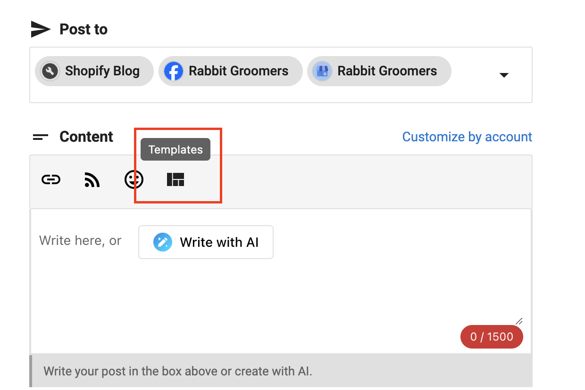

# Post Templates

Social Marketing's post template feature allows you to create reusable templates for your social media posts, saving time and ensuring consistency across your content.

## Creating Post Templates

### Template Creation Process
1. **Start a new post** by going to Posts > Create > Post 
2. **Design template** by adding text, placeholders, and formatting
3. **Save template** by clicking "Save as template" instead of scheduling the post

### Template Elements
- **Text Content**: Pre-written text with customizable placeholders
- **Hashtag Sets**: Pre-defined hashtag collections for different topics
- **Image Placeholders**: Designated spots for images or graphics
- **Call-to-Action**: Standard CTAs that can be customized
- **Brand Elements**: Consistent branding elements across templates

## Template Categories

### Content Type Templates
- **Product Promotions**: Templates for promoting products or services
- **Educational Content**: Templates for sharing tips and information
- **Behind-the-Scenes**: Templates for showing company culture
- **Customer Spotlights**: Templates for featuring customer stories
- **Event Announcements**: Templates for promoting events

### Platform-Specific Templates
- **Instagram Templates**: Optimized for Instagram's format and audience
- **Facebook Templates**: Designed for Facebook's engagement patterns
- **LinkedIn Templates**: Professional templates for LinkedIn
- **Twitter/X Templates**: Concise templates for Twitter's character limit
- **Multi-Platform Templates**: Templates that work across platforms

## Using Post Templates

### Template Application
1. **Select Template**: Choose a template from your library by clicking the Templates button in the post composer

2. **Customize Content**: Fill in placeholders with specific content
3. **Add Media**: Insert relevant images or videos
4. **Review and Edit**: Review the post and make final adjustments
5. **Schedule or Post**: Schedule or publish the customized post

### Template Customization
- **Text Replacement**: Replace placeholder text with specific content
- **Media Addition**: Add relevant images, videos, or graphics
- **Hashtag Updates**: Modify hashtags for specific campaigns
- **Timing Adjustments**: Adjust posting times for different audiences
- **Platform Optimization**: Optimize for specific platform requirement

## Template Examples

### Product Promotion Template

🎉 [Product Name] is here! 

[Product Description]

✨ Key Features:
• [Feature 1]
• [Feature 2] 
• [Feature 3]

💡 [Call-to-Action]

[BrandHashtag] [ProductHashtag] [IndustryHashtag]

### Educational Content Template

📚 [Topic Title]

[Educational Content]

💡 Pro Tip: [Helpful Tip]

Want to learn more? [Call-to-Action]

[EducationalHashtag] [IndustryHashtag] [BrandHashtag]
